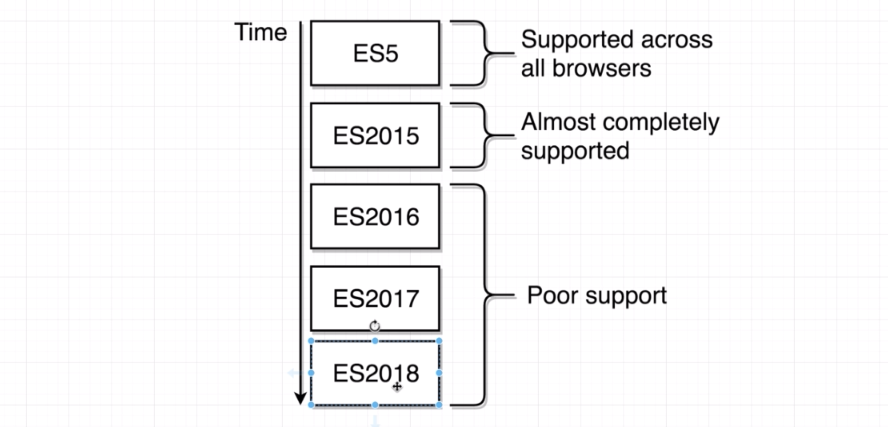
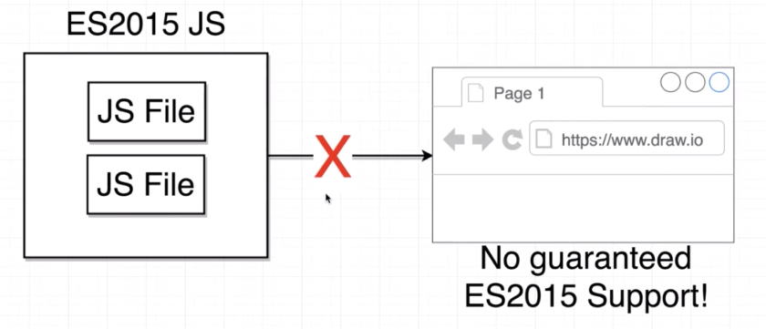
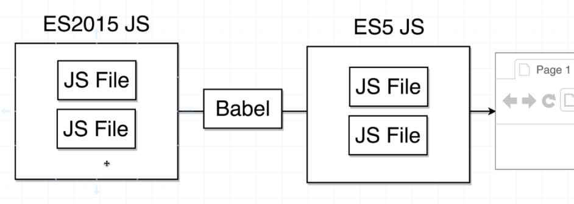
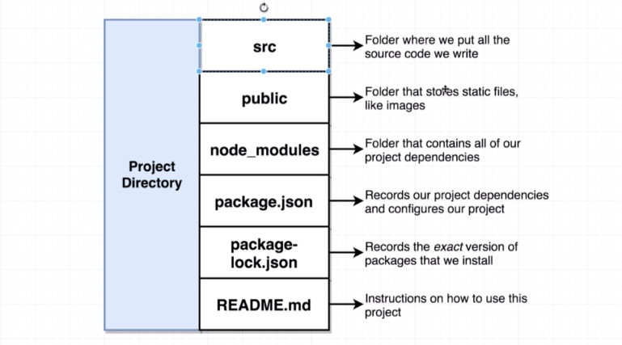
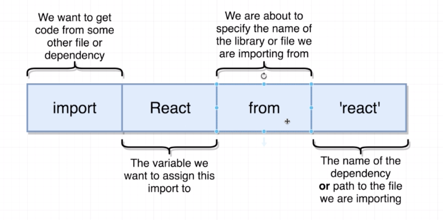
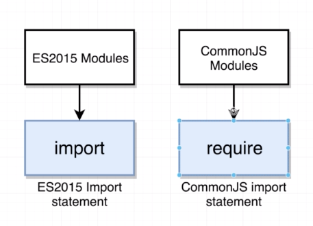
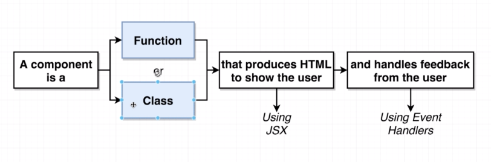

# Section01. Let's Dive In!

## Our First App

* 리액트가 무엇인가에 대한 설명을 듣는것은 꽤 지루한 일
* 때문에 바로 작은 리액트 앱을 만들어보면서 이해를 하는게 좋을것 같음
* [online tool](https://codepen.io/sgrider/pen/yRWZEq)을 이용하여 연습을 먼저 해볼것을 권장함

## Critical Questions!

* 리액트란? 자바스크립트 라이브러리
* 리액트의 목적? 유저에게 content(HTML)을 보여주는것, 유저 interaction을 handle하는 (마우스클릭, 드래그 등등)
* redux를 앱 만드는데 쓰지 않는 이유? 리액트로도 충분, 좀 더 커지고 복잡한 앱을 만들고 싶어질때 사용
* class가 하는 일? Javascript의 class
* 앞에서 보인 HTML은 무엇? JSX임, HTML과 비슷, Javascript코드에 넣을 수 있는것. 일반적 HTML처럼 react앱의 content를 결정할 수 있 
* React와 ReactDOM을 추가한 이유는? React는 둘로 나뉨, React는 component가 뭔지, 어떻게 components들이 함께 작동하는지를 알고 있고, ReactDOM은 component를 받을지, DOM에 나타낼지를 알고 있음

## Generating a React Project

1. Node JS 설치 혹은 업데이트
2. create-react-app 설치
   * npm : node project manager
   * install : packge onto our computers
   * -g : installs this package globally so we can run it from the terminal
   * create-react-app : name of the package

```bash
npm install -g create-react-app
```

3. create react app

```bash
create-react-app [프로젝트명]
npx create-react-app [프로젝트명] 
#같은 명령어
```

## Why Create React App

* create-react-app을 통해 react앱을 새로 만들 때는 아래에서 webpack, babel, dev server이 세가지가 알아서 설치되고 작동됨

* Babel

  * JS의 버전에 따라 브라우저와의 호환여부가 달라짐

  

  * ES2015의 경우 호환된다는 보장이 없음

  

  * 이때 필요한 것이 바벨인데 바벨은 ES2015의 코드를 ES5 코드로 바꿔줌

  

## Exploring a Create-React-App Project

* create-react-app 구성요소

  

## Starting and Stoping a React App

* react app을 실행하는 명령어를 이용해 실행하면 `http://localhost:3000`로 실행됨

  ```bash
  npm start
  ```

* stop 하는 방법은 `Ctrl + C`를 통해 가능

* port:3000이 이미 실행되고 있다면 다른 포트로도 시작 가능

## Javascript Module Systems

* `src`폴더에 있는 내용을 모두 지워보고 `index.js`라는 파일을 우선 만듦

* 그리고 `react`와 `react-dom`을 import해줌

  * 이때 명령어 구성은 아래와 같음

    

  ```javascript
  import React from 'react';
  import ReactDOM from 'react-dom'
  ```
  * js module은 보통 require로 하고, ES6에 들어와서 import를 사용

    

## Displaying Content with Functional Components

* component는 function base 혹은 class base로 생성 가능

  

* 간단한 react component를 만들기 위해서는 아래와 같이 시작하는데, 이를 function 키워드 대신 arrow function로 대체하여 사용 가능

  ```react
  const App = function (){
      return <div>Hi there!</div>;
  }
  
  const App = () => {
      return <div>Hi there!</div>;
  }
  ```

* `/public/index.html`에 보면 `id`가 `root`인 `div`가 있는데 이 곳으로 render시키기 위해 `index.js`에 아래와 같이 작성해줌

  ```html
  <title>React App</title>
  </head>
  <body>
      <noscript>You need to enable JavaScript to run this app.</noscript>
      <div id="root"></div>
      <!--
  		This HTML file is a template.
  ```

  ```react
  ReactDOM.render(
      <App />,
      document.querySelector('#root')
  );
  ```