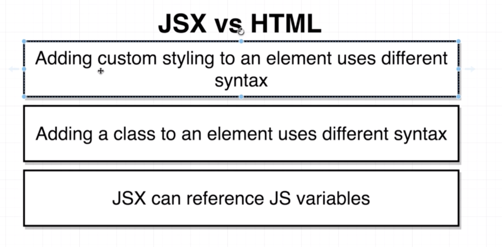
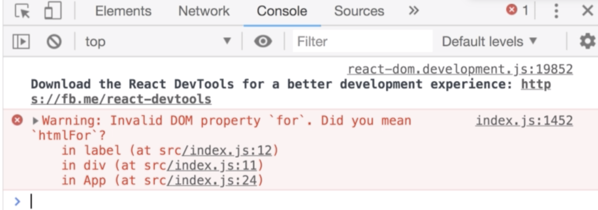

# Section02. Building content with JSX

## What is JSX?

* 앞에서 언급한 대로, 일반적으로 ES6의 코드는 모든 브라우저에서 작동하지 않음, 그래서 보통은 Babel을 이용하여 모든 브라우저에 통하도록함

* [Babel](https://babeljs.io)로 접속하여 `PRESETS`를 `react`로 맞춰준 다음 앞서 작성한 코드를 입력해주면 다음과 같은 결과를 얻음

  * 눈에 띄게 JSX가 가독성 좋고 편하다는것을 느낄 수 있음

  ```react
  const App = () => {
      return <div>
        <ul>
          <li>Hello</li>
        </ul>
      </div>;
  }
  
  "use strict";
  
  var App = function App() {
    return React.createElement(
      "div",
      null,
      React.createElement(
        "ul",
        null,
        React.createElement(
          "li",
          null,
          "Hello"
        )
      )
    );
  };
  ```

## Converting HTML to JSX

* 간단한 HTML과 JSX비교 예제

  ```html
  <div>
    <label for="name" class="label">Enter name:</label>
    <input id="name" type="text" />
    <button style="background-color: blue; color: white;">Submit</button>
  </div>
  ```

* 주의사항 아래와 같이 코드를 작성하면 react는 return 값으로 undefined를 배출함

  ```react
  const App = () => {
      return
          <div>
              ...
          </div>
  };
  ```

  * 따라서 아래와 같이 return 뒤에 바로 `<div>`(opening tag)를 붙여주어 return 값으로 JSX블럭을 리턴하도록 해줘야함

  ```react
  const App = () => {
      return <div>
              ...
          </div>
  };
  ```

  * 이걸 신경써주기는 귀찮기때문에 아래와 같이 `()`를 이용하여 하나의 JSX블록임을 전달함

  ```react
  const App = () => {
      return (
      	<div>
          	...
      	</div>
  	);
  };
  ```

## Inline Styling with JSX

* JSX와 HTML의 차이

  

  * Style 쓰는 방식

    * HTML

    ```html
    <div style="background-color: red;"></div>
    ```

    * JSX

    ```react
    <div style={{ backgroundColor: 'red'}}></div>
    ```

## Converting styling to JSX Format

* html 과 달리 style에 들어가는 값은 javascript object임

  ```react
  const App = () => {
      return(
      	<div>
          	...
              <button style="background-color: blue; color: white;">Submit</button>
              <button style={{ backgroundColor: 'blue', color: 'white' }}>Submit</button>
          </div>
      );
  };
  ```

* JSX에서 `string`을 의미하는 것은 모두 `''`를 사용해주는게 보통 관례 나머지(Javascript object 등)는 `""`를 사용

  ```react
  <label class="labe" for="name"></label>
  ```

## class vs className

* JSX에서 html의 `class` 이름을 보통 `className`으로 쓰는 이유는 Javascript의 `class`키워드와의 중복을 피하기 위함

  ```react
  class App extends React.Component
  ...
  <labe className="label" for="name"></labe>
  ```

## Referencing JS Variables in JSX

*  JSX에서 JS variable을 불러오는 방법

  ```react
  function getButtonText(){ //2. 함수의 return을 통해 불러오기
      return 'Click on me!';
  }
  const App = () => {
      const buttonText = 'Click Me!'; // 1. 변수를 사용하여 불러오기
      return(
      	<div>
          	...
              <button style={{ backgroundColor: 'blue', color: 'white' }}>
              	{ buttonText } <!-- 1번 경우 -->
                  { getButtonText() } <!-- 2번 경우 -->
              </button>
          </div>
      );
  };
  ```

## Values JSX Can't Show

* JSX에서 Variable을 통해 변수를 넘겨줄 때는 그 값이 꼭 string이거나 특정한 데이터 타입일 필요는 없음 아래와 같이 array도 가능

  ```react
  ...
  const buttonText= [10,20]
  ...
  <button ...>
      { buttonText }
  </button >
  ```

  * 하지만 javascript object는 불가능

  ```react
  ...
  const buttonText= {text: 'Click me!'};
  ...
  <button ...>
      { buttonText }
  </button >
  ```

  * 아래와 같이 object의 key를 통해 접근해서는 가능

  ```react
  ...
  const buttonText= {text: 'Click me!'};
  ...
  <button ...>
      { buttonText.text }
  </button >
  ```

* 따라서, React에서 스타일을 줄 때는 보통 다음과 같이 함

  ```react
  const App = () => {
      const buttonText = 'Click Me!'; // 1. 변수를 사용하여 불러오기
      const style= { backgroundColor: 'blue', color: 'white' };
      return(
      	<div>
          	...
              <button style={style}>
              	{ buttonText } <!-- 1번 경우 -->
              </button>
          </div>
      );
  };
  ```

## Finding Forbidden Property Names

* 만약에 일반적으로 react에서 금지하는 property name을 썼다면 개발자도구의 `console`을 통해서 아래와 같이 확인이 가능하다.

  ```react
  const App = () => {
      const buttonText = 'Click Me!'; // 1. 변수를 사용하여 불러오기
      const labelText = 'Enter name:';
      return(
      	<div>
              <label for="name" class="label">
              	{ labelText }
              </label>
                  ...
  ```

  

  * `<label>`에 있는 `for`이라는 property name을 `htmlFor`로 바꿔주면 에러가 사라짐, for을 js의 for로 볼 수 있기 때문에 에러 표시 
