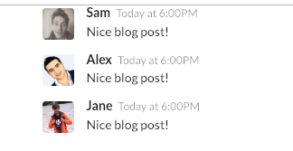

# Section03. Communicating with Props

## Three Tenets of Components

* components에 관해 3가지는 꼭 알고 있어야 함
  * Component **Nesting** : component는 다른 component의 안에 존재할 수 있음
  * Component **Reusability**: component는 app전반에 걸쳐 쉽게 재사용되어야함
  * Component **Configuration**: 컴포넌트를 만들었을때 구성이 가능해야함

## Getting Some Free Styling

* 터미널창에 `create-react-app components`명령어를 통해  연습할 환경을 생성해주고 `src`폴더에 있는 모든 파일을 제거해줌

* `src` 폴더에 `index.js`파일을 생성해주고 아래와 같이 코드를 입력

  ```react
  import React from 'react';
  import ReactDOM from 'react-dom';
  
  const App = () => {
      return <div>Hi there!</div>
  };
  
  ReactDOM.render(<App />, document.querySelector('#root'))
  ```

* `/src/index.html`의 `<head>`부분에 semantic-ui를 추가하여 쉽게 ui를 구성

  ```html
  <link rel="stylesheet" href="https://cdnjs.cloudflare.com/ajax/libs/semantic-ui/2.4.1/semantic.min.css"/>
  
  ```

## Naive Component Approach

* 기본 작성 Static app을 작성해봄

  ```react
  import React from 'react';
  import ReactDOM from 'react-dom';
  
  const App = () => {
      return (
          <div className="ui container comments">
              <div className="comment">
                  <a href="/" className="avatar">
                      
                  </a>
                  <div className="content">
                      <a href="/" className="author">
                          Sam
                      </a>
                      <div className="metadata">
                          <span className="date">Today at 6:00PM</span>
                      </div>
                      <div className="text">Nice blog post!</div>
                  </div>
              </div>
          </div>
      );
  };
  
  ReactDOM.render(<App />, document.querySelector('#root'))
  ```

## Specifying images in JSX

* JSX에서 이미지를 넣는 법을 알아볼 것임

* [fake.js](https://github.com/marak/Faker.js/)는 가짜 데이터 혹은 가짜 이미지등을 만들어주는 라이브러리임

* 터미널에서 아래와 같이 입력해주어 `fake.js`를 설치해줌

  * 여기서 `—save`는 `-g`의 global 설치와는 달리 local project에만 설치함을 의미함

  ```bash
  npm install --save faker
  ```

* 그런 다음 `index.js`를 다음과 같이 수정・  추가해줌

  ```react
  import faker from 'faker';
  ...
  
  ```

  

## Extracting JSX to New Components

* 재사용성있으며 구성가능한 component를 만드는 법

  

* component분리를 위해 `CommentDetail.js`를 `src`폴더에 생성해주고 다음과 같이 코드를 작성함

  ```react
  import React from 'react';
  
  const CommentDetail = () => {
      return(
      	<div className="comment">
              <a href="/" className="avatar">
                  
              </a>
              <div className="content">
                  <a href="/" className="author">
                      Sam
                  </a>
                  <div className="metadata">
                      <span className="date">Today at 6:00PM</span>
                  </div>
                  <div className="text">Nice blog post!</div>
              </div>
          </div> 
      );
  }
  ```

## Component Nesting

* 앞서 작성했던 코드에서 `comment`부분을 분리하였음

* 이에 `faker`를 `import`하는 코드 역시 사용하는 부분과 함께 쓰여야 올바르게 작동함

  ```react
  import React from 'react';
  import faker from 'faker';
  
  const CommentDetail = () => {
  ...
  
  ...
  ```

* 현재 이 상태에서는 `index.js`와 `CommentDetail.js`는 그 어떠한 연결관계가 없는 상태, 독자적인 파일로 존재하는 상태임

  

  * 이를 연결해 주기 위해 다음 그림과 같이 두 가지를 추가해줌

  

  

* `index.js`를 다음과 같이 수정함, jsx에 javascript를 부를 때 쓰는 `{}`와는 달리 component를 불러올 때는 `</>`를 사용하여 불러옴

  ```react
  import React from 'react';
  import ReactDOM from 'react-dom';
  import CommentDetail from './CommentDetail'
  
  const App = () => {
      return (
          <div className="ui container comments">
              <CommentDetail />
              <CommentDetail />
              <CommentDetail />
          </div>
      );
  };
  
  ReactDOM.render(<App />, document.querySelector('#root'))
  ```

## React's Props System

* 현재까지의 예제 앱 구조는 다음과 같음

  

* **Props** : 부모 component에서 자식 component로 데이터를 넘겨주는 시스템, 자식 component를 커스터마이즈 하거나 구성하는 것을 목적으로 사용됨

* 이러한 props를 이용하여 다음과 같이 앱을 구성할 예정

  

## Passing and Receiving Props

* Props는 Properties의 축약어

* props를 부모에서 자식으로 제공하는 방법

  * 여기서 "Sam"과 같은 정적인 값 말고 `{}`를 활용하여 js의 변수를 불러와 동적으로 할당해 줄 수 있음

  

* 다음과 같이 props를 `index.js`에 설정해줌

  ```react
  ...
   <div className="ui container comments">
      <CommentDetail author="Sam"/>
      <CommentDetail author="Alex"/>
      <CommentDetail author="Jane"/>
  </div>
  ...
  ```

* `CommentDetail.js` component에서 값을 받아올 때, 다음과 같이 첫 변수로 `props`를 설정하여 넘어오는 props 값을 받아옴

  ```react
  ...
  const CommentDetail = (props) => {
      console.log(props);
  ...
  ```

  * `console.log(props)`로 값을 찍어보면 다음과 같이 찍힘

  

* `props`에서 autor 값을 불러옴

  ```react
  ...
  <a href="/" className="author">
      {props.author}
  </a>
  ...
  ```

  

## Passing Multiple Props

* 하나의 프로퍼티만 넘겨주는게 아닌 한번에 여러개의 프로퍼티를 props에 담아서 넘겨줌

  ```react
  ...
  <div className="ui container comments">
      <CommentDetail author="Sam" timeAgo="Today at 4:45PM"/>
      <CommentDetail author="Alex" timeAgo="Today at 2:00PM"/>
      <CommentDetail author="Jane" timeAgo="Yesterday at 5:00PM"/>
  </div>
  ...
  ```

  

## Passing Props - Solutions

* props가 많아지면 아래와 같이 쓰는 것이 가독성이 좋음

  ```react
  <CommentDetail 
      author="Sam" 
      timeAgo="Today at 4:45PM"
      content="Nice blog post"
  />
  ```

* avatar 역시 props로 넘겨주는 것으로 변경해줌

  ```react
   <CommentDetail 
       author="Sam" 
       timeAgo="Today at 4:45PM"
       content="Nice blog post"
       avatar={faker.image.avatar()}
  />
  ```

## Implementing an Approval Card

* `ApprovalCard.js`파일을 생성하고 `semantic-ui`로 카드 형태를 생성해줌

  ```react
  import React from 'react';
  
  const ApprovalCard = () => {
      return(
      	<div className="ui card">
              <div className="content">
                  Are you sure?
              </div>
              <div className="extra content">
                  <div className="ui two buttons">
                      <div className="ui basic green button">Approve</div>
                      <div className="ui basic red button">Reject</div>
                  </div>
              </div>
          </div>
      );
  }
  
  export default ApprovalCard;
  ```

  

## Showing Custom Children

* `ApprovalCard`안에 `CommentDetail`을 담기 위해서는 다음과 같이 변경해주면 됨 

  * 아래 코드와 같이 담게 되면 `ApprovalCard`의 `props`로 `CommentDetail`을 담게 됨

  ```react
  <ApprovalCard>
      <CommentDetail 
          author="Sam" 
          timeAgo="Today at 4:45PM"
          content="Nice blog post"
          avatar={faker.image.avatar()}
          />
  </ApprovalCard>
  
  ```

* `ApprovalCard.js` 에서 받은 `props`를 `console.log`를 찍어보면 다음과 같음

  ```react
  import React from 'react';
  
  const ApprovalCard = (props) => {
      console.log(props);
  ...
  ```

  

* 그런 다음 카드 안에 데이터를 표현하고 싶다면 다음과 같이 `props`에서 불러와 사용하면 됨

  ```react
  ...
  <div className="ui card">
      <div className="content">
          {props.children}
      </div>
  ...
  ```

  

## Component Reuse

* 아래와 같이 여러 component 를 자식 component로 사용할 수 있음

  * 반드시 `{props.children}`을 선언하여 명시해둬야만 다음과 같이 작동함

  ```react
   <ApprovalCard>
      <div>
          <h4>Warning!</h4>
          Are you sure you want to do this?
      </div>
  </ApprovalCard>
  ```

  
