# Section04. Structuring Apps with Class-Based Components

## Class-Based Components

* **컴포넌트**란 유저에게 보여줄 `HTML` 을 생산하고 유저로 부터 피드백을 받는 `function` 혹은 `class`

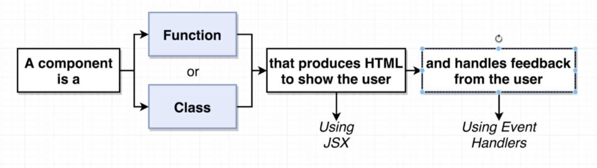

* 이전에 section03 까지의 내용은 다음과 같았음

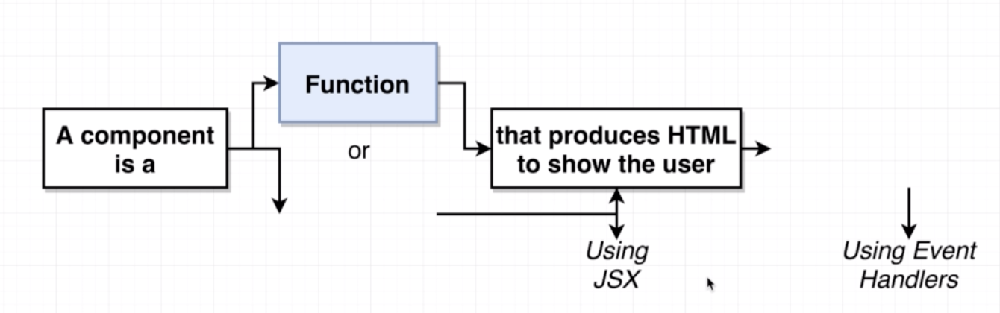

* 컴포넌트는 두 종류로 나뉨, Functional Components 와 Class Components
  * 이전까지는 functional components를 활용한 간단한 코드를 작성했다면 이번 섹션부터는 class components를 활용하여 유저의 피드백까지 받아볼 예정

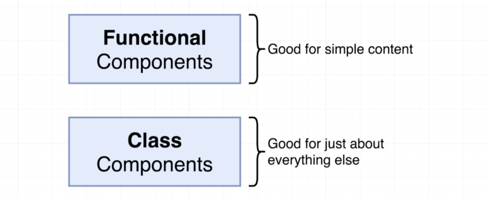

* Class Components 의 이점
  * 코드를 쉽게 정리 가능
  * `state` 를 활용하여 유저 input을 쉽게 다룰 수 있음
  * lifecycle events를 이해하여 앱이 시작될 때 행해질 것들을 정할 수 있음(뒤에서 자세히)

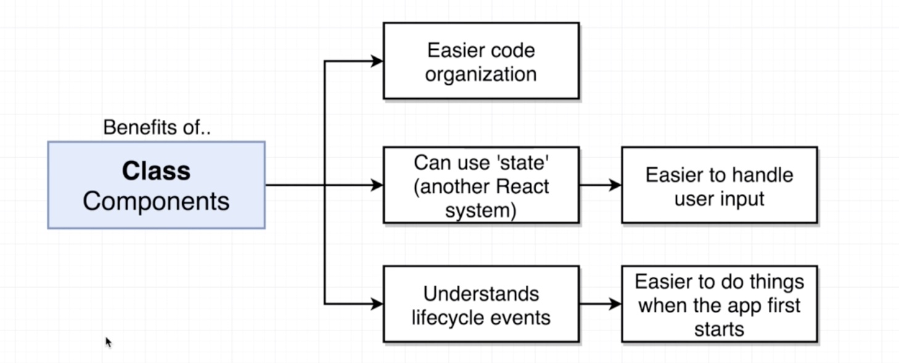

## Scaffolding the App

* 실습을 위해 다음과 같이 seasons라는 react 프로젝트를 생성해줌

```bash
create-react-app seasons
cd seasons
npm start
```

* 이전과 마찬가지로 `./public/index.html`에  `semantic-ui`의 css파일을 불러옴

```html
<link rel="stylesheet" href="https://cdnjs.cloudflare.com/ajax/libs/semantic-ui/2.4.1/semantic.css">
```

* `src` 폴더에 모든 파일을 지운 뒤 `index.js` 파일을 생성해 줌

```react
import React from 'react';
import ReactDOM from 'react-dom';

const App = () => {
    return <div>Hi there!</div>;
};

ReactDOM.render(<App />, document.querySelector('#root'))
```

* 이번 실습 seasons앱은 다음과 같은 구성을 가질 예정

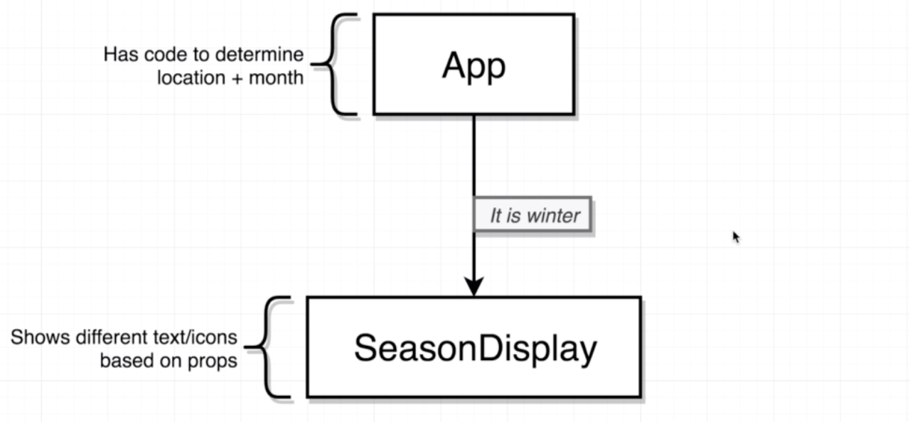

* `SeasonDisplay.js`파일을 생성해줌

```react
import React from 'react';

const SeasonDisplay = () => {
    return <div>Season Display</div>;
};

export default SeasonDisplay;
```

## Getting a Users Physical Location

* 이번 실습에서는 Geolocation API를 사용할 예정, 이는 이용자의 현재 위치를 받아오는 API임
* [Geolocation API](https://developer.mozilla.org/en-US/docs/Web/API/Geolocation_API)에 접속하면 사용법에 대해 예시와 함께 나와있음

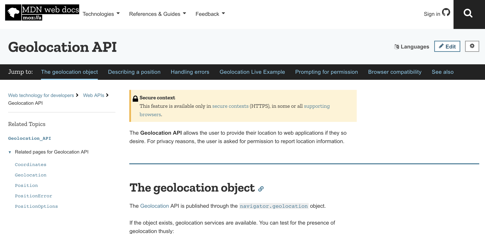

* 다음과 같이 `index.js`에 코드를 작성하여 `console` 창에 현재 위치를 찍어낼 수 있음

```react
...
const App = () => {
    window.navigator.geolocation.getCurrentPosition(
        (position) => console.log(position),
        (err) => console.log(err)
    );
...
```

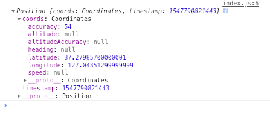

* `console` 창 옆에 ...으로 된 모양이 있는데 이를 클릭하여 센서를 클릭해주면 다음과 같은 창을 볼 수 있음

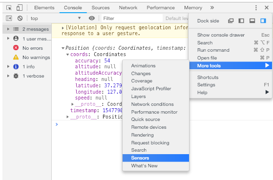

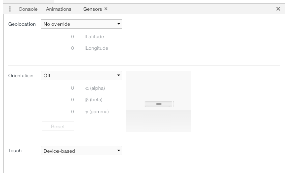

* 이 sensors에서 Geolocation을 원하는 도시로 선택해 주면 위치의 기본값이 지정한 도시로 설정됨 refresh를 하게되면 그지역으로 위경도가 바뀜

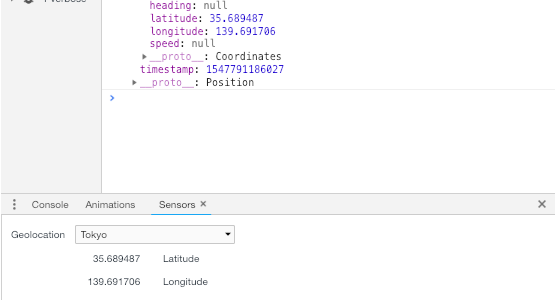

## Resetting Geolocation Preferences

* `position`을 불러오는 것 외에 에러를 일부러 일으켜 `err`가 콘솔창에 출력이 되는 것을 확인하려고 함
* 다음과 같이 위치정보 제공을 차단으로  설정해줌

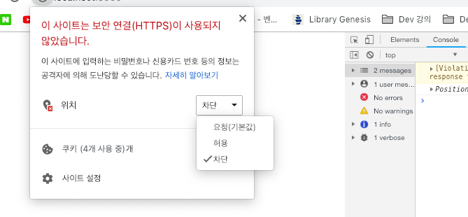

* 다음과 같이 에러 메세지가 출력됨을 확인할 수 있음

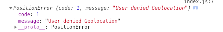

## Handling Async Operations with Functional Components

* 아래는 브라우저가 유저의 위치정보를 불러오는 타임라인을 정리해본 것
  * 여기서 geolocation service를 불러오는 것은 많은 시간이 걸림

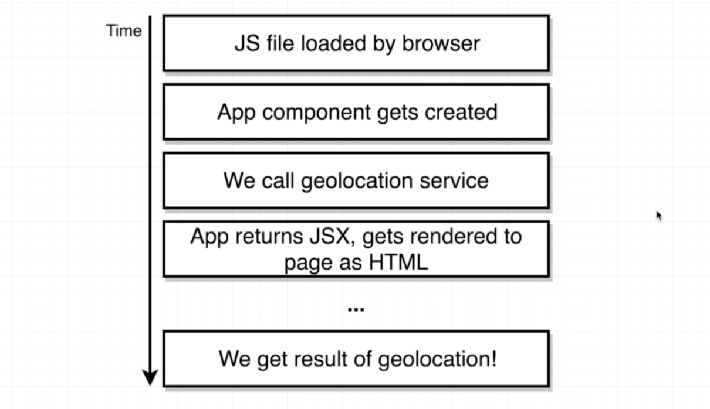

* `index.js`에서 `return` 부분을 다음과 바꿔주고 Latitude를 `position`에서 불러와 사용하고 싶지만 이는 Functional components에서는 불가능함, Class components로 가능

```react
...
const App = () => {
    window.navigator.geolocation.getCurrentPosition(
        (position) => console.log(position),
        (err) => console.log(err)
    );
    return <div>Latitude: </div>;
};
...
```

## Refactoring from Functional to Class Components

* Class Components를 이용하여 다음과 같이 앱을 바꿔볼 예정

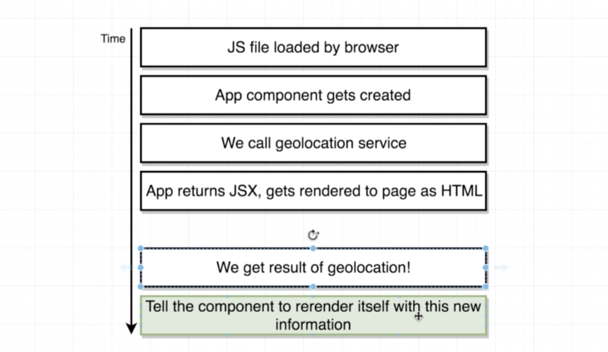

* Class components의 규칙

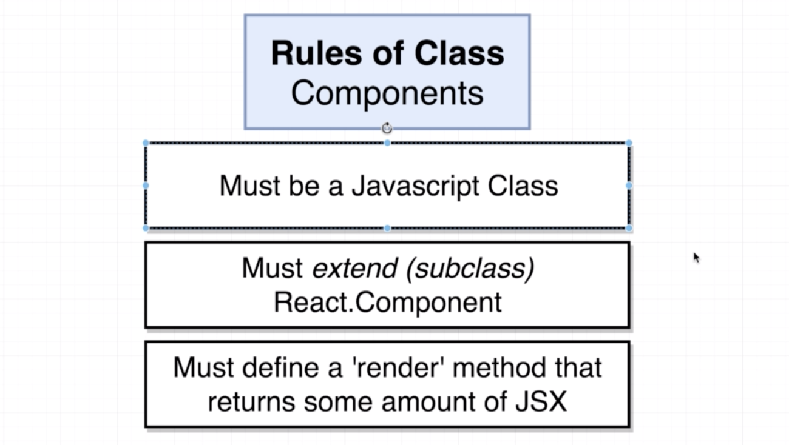

* `index.js` 에서 다음과 같이 Functional Components를 Class Components로 변경해 줌
  * `render` 등의 메소드를 빌려오기 위해 `React.Component` 를 extends함

```react
import React from 'react';
import ReactDOM from 'react-dom';

class App extends React.Component {
    render() {
      window.navigator.geolocation.getCurrentPosition(
            (position) => console.log(position),
            (err) => console.log(err)
        );
        return <div>Latitude: </div>;
    }
}

ReactDOM.render(<App />, document.querySelector('#root'))
```

