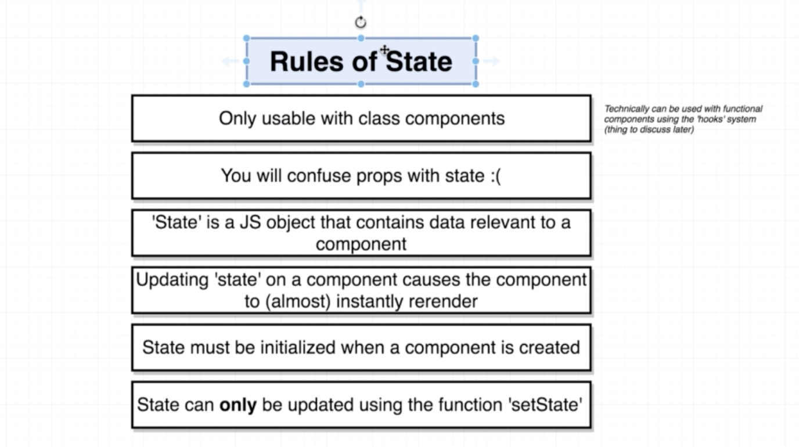
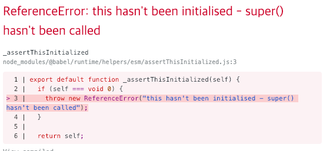
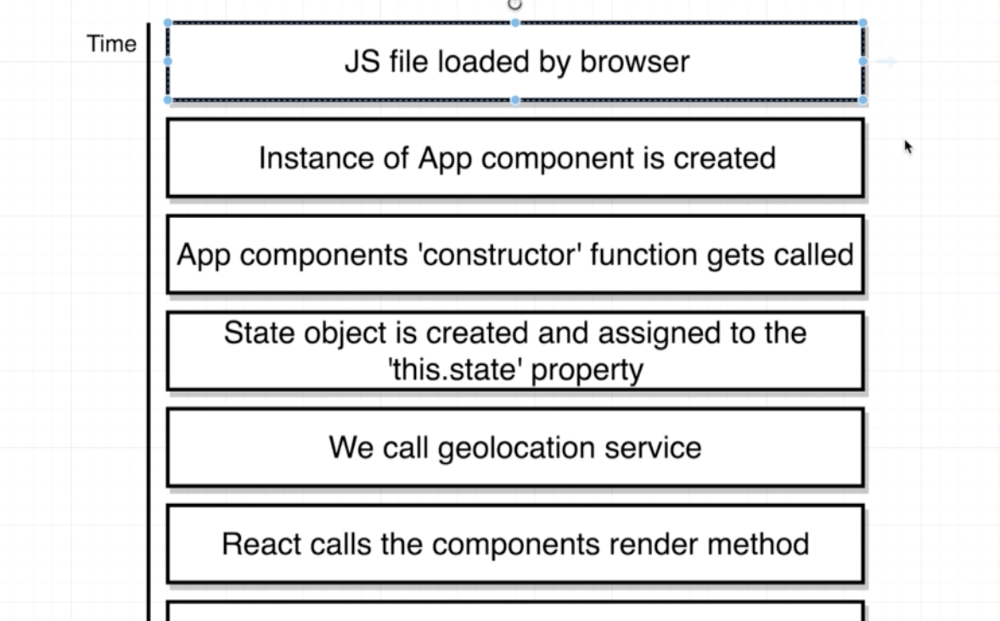
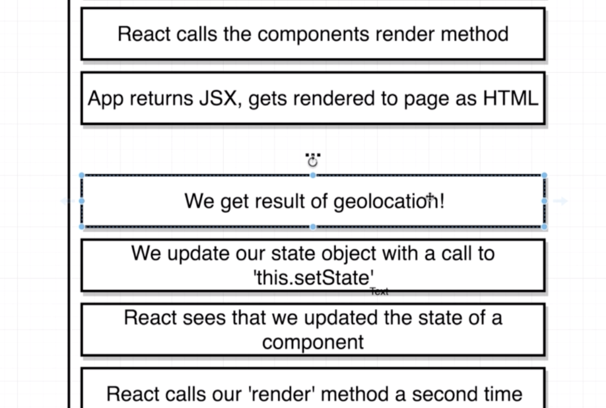
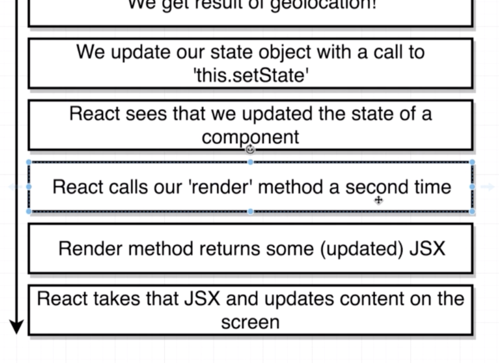
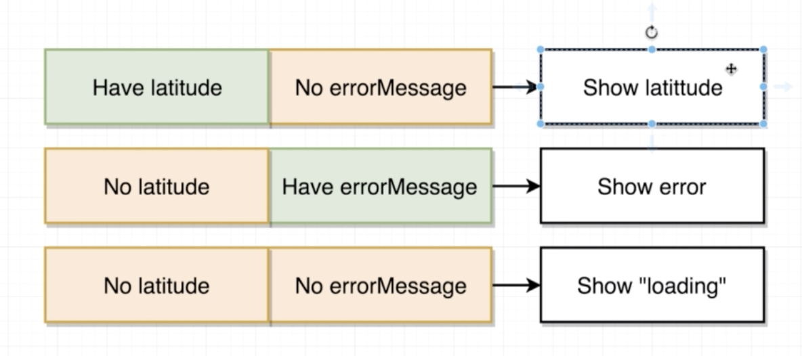

# Section05. State in React Components

## The Rules of State

* State와 관련된 규칙은 다음과 같음
  * Class Components에서만 사용 가능(hooks 시스템을 이용한다면 functional에서도 가능하지만 후에 다시)
  * props와 state는 자주 혼동됨
  * State는 컴포넌트와 관련된 데이터를 담고있는 JS object
  * state를 업데이트하면 컴포넌트를 즉시 다시 랜더링함
  * state는 컴포넌트가 생성되었을 때 바로 초기화되어야함
  * state는 `setState` 함수를 통해서만 업데이트 되어야함(굉장히 중요)



## Initializing State Through Constructors

* `render()` 메소드는 우리가 만드는 모든 리액트 컴포넌트에 존재함, 없으면 공중에 그냥 버려버림
* `constructor()`함수는 React에서만 특정된게 아니라 JS에서 쓰이는 함수임
  * `class`내에 존재하며, 다른 무엇보다 먼저 call됨
  * 따라서, 여기에 `state`를 저장하는게 좋음
  * 여기서 사용된 `super`은 부모 컴포넌트에 존재하는 `constructor` 의 매개변수
  * 아래와 같이 사용하며, 여기서 super을 빼먹을 경우 그림과 같은 에러 메세지를 토해냄

```react
...
class App extends React.Component {
constructor(props){
    super(props);
}
...
```



* `constructor` 에는 다음과 같이 `state` 를 저장할 object를 생성해 둠
  * 여기서 초기값을 설정할때는 보통 문자열의 경우 `''`, 숫자의 경우 `null` 과 같이 설정함

```react
...
class App extends React.Component {
    constructor(props){
        super(props);
        this.state = { lat: null };
    }
...
```

## Updating State Properties

* `this.state`에 할당된 값은 `App` 내에서 쉽게 불러올 수 있음
```react
...
return <div>Latitude: {this.state.lat}</div>;
...
```

* `render` 메소드를 통해 바로 유저의 위치정보를 받아오는 것 보다 더 나은 곳에 두려고함
  * `constructor`에 둘 경우 앞에 말한 것처럼 `App`이 실행되고 제일 먼저 유저의 정보를 받아오게 됨 
  * `render` 에 두게 될 경우 실수로 두번 패치 될 수도 있음

```react
...
class App extends React.Component {
    constructor(props){
        super(props);
        this.state = { lat: null };
        window.navigator.geolocation.getCurrentPosition(
            position => console.log(position),
            err => console.log(err)
        );
    }
    render() {
        return <div>Latitude: {this.state.lat}</div>;
    }
}
...
```

* data를 state에 업데이트 해주기 위해서는 다음과 같이 `setState()` 함수를 통해서 업데이트 해줘야함
  * `this.state.lat = position.coords.latitude` 와 같이직접 할당하는 것은 정말 잘못된 것임, 반드시 `setState()` 함수를 사용할 것
  * `this.state`를 초기화 할 때가 유일한 직접 할당하는 때

```react
...
class App extends React.Component {
    constructor(props){
        super(props);
        this.state = { lat: null };
        window.navigator.geolocation.getCurrentPosition(
            position => { 
                this.setState({ lat: position.coords.latitude });
        },
            err => console.log(err)
        );
    }
    render() {
...
```

## App Lifecycle Walkthrough

* `window.navigator.geolocation....`는 `constructor`가 실행되는 그 시점에 실행되는 게 아니라 나중에 어떤 특정한 시점에 실행됨







## Handling Errors Gracefully

* 에러메세지를  `state`에 업데이트 해주기 위해 코드를 다음과 같이 수정
  * 여기서 error메세지가 업데이트 된다고 lat이 사라지거나 초기화 되는 것은 아님

```react
...
this.state = { lat: null, errorMessage: '' };
window.navigator.geolocation.getCurrentPosition(
	position => {
        this.setState({ lat: position.coords.latitude });
    },
    err => {
        this.setState({ errorMessage: err.message });
    }
);
...
 return (
     <div>
         Latitude: {this.state.lat}
         <br />
         Error: {this.state.errorMessage}
     </div>
 );
```

## Conditionally Rendering Content

* `latitude` 와 `errorMessage` 를 페이지에 표시할 때 아래와 같은 세 가지 케이스로 나눌 수 있음



* 일단은 간단한 if문으로 작성하고 section06에서 다시 리팩토링

```react
...
render() {
    if (this.state.errorMessage && !this.state.lat) {
        return <div>Error: { this.state.errorMessage }</div>
    }
    if (!this.state.errorMessage && this.state.lat) {
        return <div>Latitude: { this.state.lat }</div>
    }
    return <div>Loading!</div>
}
...
```

