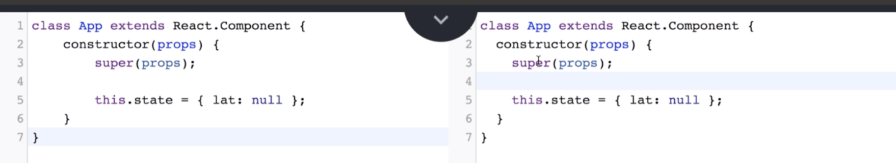

# Section06. Understanding Lifecycle Methods

## Introducing Lifecycle Methods

* 새로 배울 `state`를 initialize하는 방법은 더 자주 쓰이는 방식이기 때문에 반드시 숙지하고 있을 것
* Component Lifecycle은 다음과 같음
  * `render` 메소드는 선택이 아닌 필수
  * `render` 메소드가 호출 된 이후에 content가 화면에 보이고, `componentDidMount()` 메소드가 화면이 render될 때 1회 자동으로 call됨
    * 주로 setup이나 initial 데이터를 로드 할 때 쓰임
  * 그런 다음 update가 이뤄지는지 관찰함
  * component가 업데이트 될 때마다 `componentDidUpdate()` 메소드가 자동으로 실행 됨
  * 더 이상 component를 볼 필요가 없을 때, `componentWillUnmout`가 자동으로 실행됨
    * 보통은 component를 깨끗이 할 때 쓰임


* 이를 눈으로 보기위해 아래와 같이 `constructor` 다음에 각 메소드를 추가하여 새로고침 해보면 차례로 문장이 찍혀있음을 확인할 수 있음

```react
...
componentDidMount() {
    console.log('My component was rendered to the screen');
}
componentDidUpdate() {
    console.log('My component was just updated - it rerendered');
}
...
```


## Why Lifecycle Methods?

* 앞의 Component Lifecycle을 좀 더 자세히 살펴보면 다음과 같음
  * API를 로드하거나 데이터를 로드하는 것은 `constructor`  내부에서 기술적으론 가능하지만 이를 `componentDidMount()` 에서 하기를 권장함
  * `componentDidUpdate()` 는 데이터가 업데이트 될 때마다 이를 감지하고 자동으로 실행됨
  * `componentWillUnmount()`는 예시를 들기 지금은 애매하기때문에 나중에 다시 다루기로 함


* 위의 lifecycle 메소드 말고도 세 가지가 더 있지만 이 세 가지는 잘 쓰이지는 않음


## Refactoring Data Loading to Lifecycle Methods

* `componentDidMount()`를 사용하고 추가로 코드를 더 간결하게 리팩토링함

````react
...
class App extends React.Component {
    constructor(props){
        super(props);
        this.state = { lat: null, errorMessage: '' };
    }

    componentDidMount(){
        window.navigator.geolocation.getCurrentPosition(
            position => this.setState({ lat: position.coords.latitude }),
            err => this.setState({ errorMessage: err.message })
        );
    }
...
````

## Alternate State Intialization

* `constructor` 없이(`constructor` 가 없기 때문에`this` 도 필요 없음) 그냥 `state`를 다음과 같이 선언해주면 이전의 `constructor` 가 있었을 때랑 똑같이 작동함

```react
...
class App extends React.Component {
    state = { lat: null, errorMessage: '' };

    componentDidMount(){
...
```

* 내부에서 실제로 어떻게 작동하는지 보기 위해서 [babel](https://babeljs.io) 로 접속하여 `constructor` 를 사용하여 코드를 실행해보면 여전히 그대로인 모습을 볼 수 있음



* `state` 만 사용하여 코드를 리팩토링한대로 작성하면 다음과 같이 자동으로 `constructor` 를 생성하여 작동함을 볼 수 있음


## Passing State as Props

* `index.js` 에 아래와 같이 `SeasonDisplay.js` 를 `import` 해줌, 그리고 Latitude의 `return` 값으로 반환하도록 해줌
  * `lat={this.state.lat}` 을 인자로 넣어주는데 이를 통해 자식 요소로 데이터를 넘겨줄 수 있음

```react
...
import SeasonDisplay from './SeasonDisplay';
...
   if (!this.state.errorMessage && this.state.lat) {
            return <SeasonDisplay lat={this.state.lat}/>
        }
...
```

* 그리고 넘겨준 인자를 `props`를 통해 받아와 콘솔창에 출력해보면 올바르게 값이 넘어옴을 확인할 수 있음

```react
import React from 'react';

const SeasonDisplay = props => {
    console.log(props.lat);
    
    return <div>Season Display</div>;
};

export default SeasonDisplay;
```

## Determining Season

* 북반구인지 남반구인지를 따져 계절을 반환하는 함수를 추가하여 출력해봄

```react
import React from 'react';

const getSeason = (lat, month) => {
    if (month > 2 && month < 9) {
        return lat > 0 ? 'summer' : 'winter';
    } else {
        return lat > 0 ? 'winter' : 'summer';
    }
}
const SeasonDisplay = props => {
    const season = getSeason(props.lat, new Date().getMonth());

    console.log(season);

    return <div>Season Display</div>;
};

export default SeasonDisplay;
```

## Ternary Expressions in JSX

* `if` 문을 통해 코드를 작성해도 좋지만 삼항연산자를 통해 결과를 출력하는 것이 더 간결하고 가독성이 좋음

```react
...
const SeasonDisplay = props => {
    const season = getSeason(props.lat, new Date().getMonth());

    return (
        <div>
            <h1>{season === 'winter' ? 'Burrr, it is chilly' : 'Lets hit the beach'}</h1>
        </div>
    );
};
...
```

## Showing Icons

* [semantic-ui](https://semantic-ui.com) 에 접속하여 필요한 아이콘을 추가해줌
  * 여기서 `className` 에 변수를 써주기 위해서는 아래와 같이 ``${icon}` 로 써줘야 올바르게 변수가 작동함

```react
nj...
const SeasonDisplay = props => {
    const season = getSeason(props.lat, new Date().getMonth());
    const text = season === 'winter' ? 'Burrr, it is chilly' : 'Lets hit the beach'
    const icon = season === 'winter' ? 'snowflake' : 'sun';
    return (
        <div>
            <i className={`${icon} icon`}/>
            <h1>{text}</h1>
            <i className={`${icon} icon`}/>
        </div>
    );
};
...
```

## Extracting Options to Config Objects

* 코드가 현재 중복작성 되었기 때문에 이를 좀 더 효율적으로 리팩토링함

```react
...
const seasonConfig = {
    summer: {
        text: "Let's hit the beach!",
        iconName: 'sun'
    },
    winter: {
        text: "Burrr it's cold!",
        iconName: 'snowflake'
    }
};

const getSeason = (lat, month) => {
    if (month > 2 && month < 9) {
        return lat > 0 ? 'summer' : 'winter';
    } else {
        return lat > 0 ? 'winter' : 'summer';
    }
}

const SeasonDisplay = props => {
    const season = getSeason(props.lat, new Date().getMonth());
    const { text, iconName } = seasonConfig[season]

    return (
        <div>
            <i className={`${iconName} icon`}/>
            <h1>{text}</h1>
            <i className={`${iconName} icon`}/>
        </div>
    );
};
...
```

## Adding Some Styling

* 아이콘 사이즈를 조정하기 위해서는 다음과 같이 `className` 을 추가해주는 것만으로도 가능(semantic-ui)

```react
...
<div>
    <i className={`massive ${iconName} icon`}/>
    <h1>{text}</h1>
    <i className={`massive ${iconName} icon`}/>
</div>
...
```

* css를 따로 적용시키기 위해서는 `/src/SeasonDisplay.css` 를 생성해주고 다음과 같이 작성해주면 됨

```css
.icon-left{
    position: absolute;
    top: 10px;
    left: 10px;
}
.icon-right{
    positon: absolute;
    bottom: 10px;
    right: 10px;
}
```

* 하지만 이렇게 하기만하면 자동으로 `css`코드를 프로젝트에 추가해주지 않음, `SeasonDisplay.js`에 `css` 파일을 `import` 해주는 코드를 추가해줘야함
  * `css`파일을 `import` 하는 것은 그냥 코드를 복사 붙여넣기하는게 아니라 `webpack` 에서 알아서 처리하여 `index.html` 에 붙여줌

```react
import React from 'react';
import './SeasonDisplay.css';
...
```

* 각 컴포넌트에서 컴포넌트를 감싸는 태그의 클래스 이름을 컴포넌트 이름과 동일하게 지어주는 것이 좋음
* 추가로 다음과 같은 코드를 `css`파일에 추가해줌

```css
...
.season-display {
    display: flex;
    justify-content: center;
    align-items: center;
    height: 100vh;
}

.winter {
    background-color: aliceblue;
}

.summer{
    background-color: orange;
}

.season-display.winter i{
    color: blue;
}
.season-display.summer i{
    color: red;
}
...
```

## Showing a Loading Spinner

* Loading이란 글자보단 Spinner을 추가하여 주는 것이 좋을 것 같아 semantic-ui에서 loader을 검색하여 `/src/Spinner.js` 를 만들어서 코드 추가

```react
import React from 'react';

const Spinner = () => {
    return (
        <div className="ui active dimmer">
            <div className="ui big text loader">
                Loading...
            </div>
        </div>
    );
};

export default Spinner;
```

* `index.js` 에 `import`해줌

```react
...
import Spinner from './Spinner';
...
```

## Specifying Default Props

* 상황마다 다른 spinner 메세지를 띄워주기(재사용) 위해 `props` 를 통해 넘겨줄 예정, 이를 위해 spinner부분의 코드를 다음과 같이 수정

```react
...
const Spinner = (props) => {
...
    <div className="ui big text loader">
        {props.message}
    </div>
...
```

```react
//index.js
...
return <Spinner message="Please accept location request" />;
...
```

* `props`에 default 값을 설정하기 위해서는 다음과 같이 작성하면 특별한 인자를 넘겨주지 않더라도 기본값이 지정되어 사용됨

```react
//Spinner.js
...
Spinner.defaultProps = {
    message: 'Loading...',
};
...
```

## Avoiding Conditionals in Render

* 전체에 `border: red` 를 주고싶은데 분기문 때문에 따로 하나하나씩 줘야하는 상황이 발생하는데, 이는 비효율적이기 때문에 아래와 같이 따로 함수를 둬서 코드를 작성함
  * 항상 render 안에는 많은 return 문을 둬서는 X, 기왕이면 밖에 함수로 빼서 그 값을 리턴하여 표출하는 것이 권장됨

```react
...
renderContent() {
    if (this.state.errorMessage && !this.state.lat) {
        return <div>Error: { this.state.errorMessage }</div>;
    }
    if (!this.state.errorMessage && this.state.lat) {
        return <SeasonDisplay lat={this.state.lat}/>;
    }
    return <Spinner message="Please accept location request" />;
}

render() {
    return (
        <div className="border red">
            {this.renderContent()}
        </div>
    );
}
...
```

