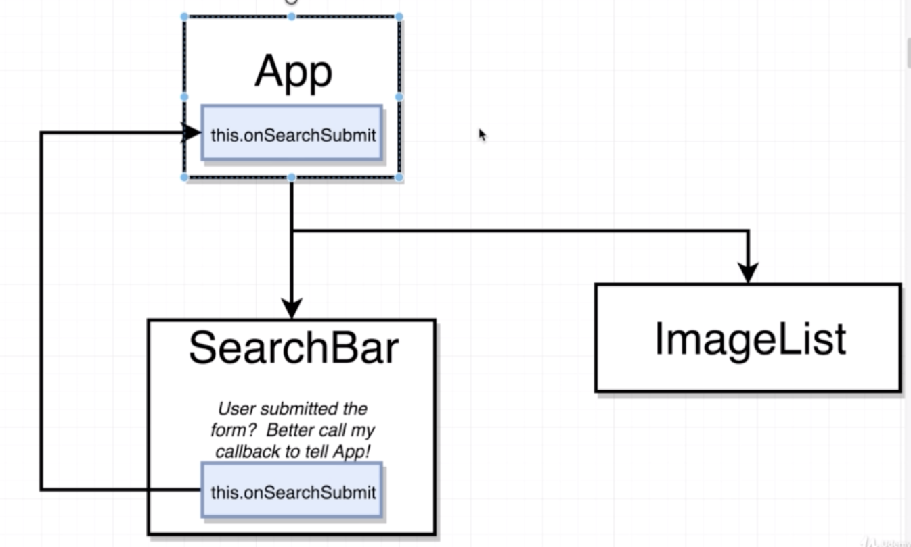

# Section07. Handling User Input with Forms and Events

## Component Design

* 이번 섹션에서는 아래와 같은 내용들을 배울 예정


## Adding Some Project Structure

* `src`에 모든 파일을 넣기보다는 `components` 폴더를 생성하여 구분하여 관리하는 것이 좋음

* `src` 의 기본 파일들을 모두 지우고 `index.js` 를 생성하고 아래와 같이 작성해줌

```react
import React from 'react';
import ReactDOM from 'react-dom';
import App from './components/App';

ReactDOM.render(
    <App />, 
    document.querySelector('#root')
);
```

* 그리고 `./components/App.js` 를 생성해주고 다음과 같이 작성해줌

```react
import React from 'react';

const App = () => {
    return <div>App</div>;
};

export default App;
```

* 이제 실습을 진행하면 됨

## Showing Forms to the User

* `./components/SearchBar.js` 를 생성, 다음과 같이 작성해 줌

```react
//SearchBar.js
import React from 'react';

class SearchBar extends React.Component {
    render() {
        return <div>Search bar</div>;
    }
}

export default SearchBar;
```

```react
//App.js
import React from 'react';
import SearchBar from './SearchBar';

const App = () => {
    return(
       <div>
           <SearchBar />
       </div> 
    )
};

export default App;
```

## Adding a Touch of Style

* `./public/index.html`에 semantic-ui추가를 위해 다음과 같은 코드를 추가해 줌

```react
<link rel="stylesheet" href="https://cdnjs.cloudflare.com/ajax/libs/semantic-ui/2.4.1/semantic.css">
```

* 기본 input field의 경우 모양이 예쁘지 않기 때문에 semantic-ui로 다음과 같이 변경해 줌
```react
//SearchBar.js
...
<div className="ui segment">
    <form className="ui form">
        <div className="field">
            <label>Image Search</label>
            <input type="text"/>
        </div>
    </form>
</div>
...
```

```react
//App.js
...
<div className="ui container" style={{marginTop: '10px'}}>
    <SearchBar />
</div>
...
```

## Creating Event Handlers

* `input` 에서 입력이 있으면 작동하는 함수를 작성해주려고함
  * 여기서 `this.onInputChange` 는 `this.onInputChange()` 처럼 쓰지 않음
  * `()`를 뒤에 붙일 경우 `SearchBar`이 render될 때마다 자동으로 call되기 때문
  * 미래의 어떤 다른 시점에서 불러오기를 희망할 때는 `()`를 붙이지 않아야함

```react
...
class SearchBar extends React.Component {
    onInputChange() {
    }
...
	<input type="text" onChange={this.onInputChange}/>
...
```

* `onInputChange`의 callback이 일어나면 자동으로 `event` object 인자 하나를 넘겨줌
  * `event.target.value`를 콘솔에 찍어보면 다음 그림과 같이 나옴

```react
...
onInputChange(event) {
    console.log(event.target.value);
}
...
```


* `onChange` 는 특별한 프로퍼티, 다른 이벤트의 경우 다른 프로퍼티 이름을 사용


* 다음과 같이 `onClick`을 테스트할 수 있음

```react
...
onInputClick(event) {
    console.log("Input Clicked!")
}
...
<input type="text" onClick={this.onInputClick} onChange={this.onInputChange}/>

...
```

* 이러한 이벤트 함수(`onInputChange`)의 네이밍 규칙은 정해진 것이 있음
  * `on`
  * `Input` : callback을 할당할 element의 이름
  * `Change` : 우리가 주시하는 event 이름

## Alternate Event Handler Syntax

* 아까의 이벤트 핸들러를 조금 다르게 쓰는 방식으로 리팩토링해봄
* 주로 코드가 짧을때, 한 줄 정도 될 때 쓰면 좋은 방식
  * 굳이 함수를 새로 정의해줄 필요 없이 arrow function으로 간단히 정의

```react
<input type="text" onChange={(e)=>console.log(e.target.value)}/>
```

## Uncontrolled vs Controlled Elements

* Uncontrolled element와 Controlled element의 차이점을 이해하면 event handler을 필요성을 이해하기 더 쉬움
* 이를 위해 아래와 같이 코드를 수정해줌

```react
import React from 'react';

class SearchBar extends React.Component {
    state = { term : '' };

    onInputChange(event) {
        console.log(event.target.value);
    }

    render() {
        return (
            <div className="ui segment">
                <form className="ui form">
                    <div className="field">
                        <label>Image Search</label>
                        <input 
                            type="text"
                            value={this.state.term}
                            onChange={e => this.setState({ term: e.target.value })}/>
                    </div>
                </form>
            </div>
        );
    }
}

export default SearchBar;
```

## More on Controlled Elements

* 앞에 작성했던 코드가 작동하는 순서는 다음과 같음


* Controlled element로 리팩토링 전에는 `input` 의 value를 알기 위해서는 직접 DOM으로 접근하여 value를 뽑아와야했음


* Controlled element의 경우에는 state로 가서 바로 확인이 가능


* DOM에 직접 default값을 두기보다는, state자체에 default 값을 줄 수도 있음, 관리가 쉬워짐

```react
...
class SearchBar extends React.Component {
    state = { term : 'Hi there!' };
...
```

* 또한 input에 들어가는 값에 변화를 직접 주어 바로 출력하는것도 가능

```react
...
<input 
	type="text"
	value={this.state.term}
	onChange={e => this.setState({ term: e.target.value.toUpperCase() })}
/>
```


## Handling Form Submittal

* 기존의 `form` 태그는 `input` 에 값을 입력하고 앤터를 누르면 자동으로 서버에 submit하려고함
* 하지만 우리는 submit할 때 페이지가 리프레시 되는 것을 원하지 않기 때문에 이러한 기능을 없애야함

```react
...
onFormSubmit(event){
    event.preventDefault();
}
...

render() {
    return (
        <div className="ui segment">
            <form onSubmit={this.onFormSubmit} className="ui form">
...
```

* 그리고 이 값을 콘솔창에 표시하게끔하면 에러가 남

```react
onFormSubmit(event){
    event.preventDefault();
    console.log(this.state.term);
}
```


## Understanding 'this' In Javascript

* 콘솔창에서 `undefined.state`를 해보면 아까 출력된 에러 메세지와 같음을 확인할 수 있음
* 클래스 내에서 쓰이는 `this` 는 다음과 같이 속해 있는 `instance` 를 가리키게 됨


*  앞의 에러를 해결하기 위해 `onFormSubmit()` 을 arrow function으로 바꿔주면, `onFormSubmit()` 내부에 존재하는 `this`가 `class SearchBar` 를 가리키는걸 확실시하게 됨

```react
onFormSubmit = (event) => {
    event.preventDefault();
    console.log(this.state.term);
}
```

* 다른 방법으로는 다음과 같이 인자로 넘겨줄 때 arrow function을 사용하는 방법임

```react
...
onFormSubmit(event){
    event.preventDefault();
    console.log(this.state.term);
}
...
<form onSubmit={event => this.onFormSubmit(event)} className="ui form">
...
```

## Solving Context Issues

* 보통은 위의 두 방법을 사용하여 `this`  문제를 해결할 것임

## Communicating Child to Parent

* `SearchBar` 컴포넌트에서 데이터를 저장하고 처리하는 역할이나 목적을 갖지 않기 때문에 이러한 일들을 처리하기 위해서는 자식 요소(SearchBar)에서 부모 요소(App)로 데이터를 전달할 필요가 있음
* `props` 는 오직 down 방향으로만 작동함


* 따라서 약간의 트릭을 주어 데이터를 부모요소로 넘겨주려고함

  * App 컴포넌트를 Class component로 변경함
  * App 컴포넌트에서 `this.onSearchSubmit`을 props로 넘겨줌 

  

  * 유저가 submit하게 되면 다음과 같이 app 컴포넌트에 call back을 일으킴 

  

## Invoking Callbacks in Children

* 먼저 `App.js` 를 Class 컴포넌트로 리팩토링해줌

```react
import React from 'react';
import SearchBar from './SearchBar';

class App extends React.Component {
    render() {
        return(
            <div className="ui container" style={{marginTop: '10px'}}>
                <SearchBar />
            </div> 
         );
    }
}

export default App;
```

* 그리고 `SearchBar`로 인자를 넘겨줌
  * 여기서 `onSubmit` 의 이름은 마음대로 바꿔줘도 상관 없지만 편의상 `onSubmit` 도 적당한 이름이기 때문에 그냥 사용
  * 일반 JSX의 경우 불가능하지만 직접 정의한 컴포넌트이기 때문에 상관X

```react
import React from 'react';
import SearchBar from './SearchBar';

class App extends React.Component {
    onSearchSubmit(term){
        console.log(term);
    }

    render() {
        return(
            <div className="ui container" style={{marginTop: '10px'}}>
                <SearchBar onSubmit={this.onSearchSubmit}/>
            </div> 
         );
    }
}

export default App;
```

* 그런 다음 `SearchBar.js` 의 `onFormSubmit()` 을 다음과 같이 수정해줌

```react
onFormSubmit = (event) =>{
    event.preventDefault();
    this.props.onSubmit(this.state.term);
}
```