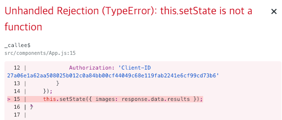

# Section08. Making API Requests with React

## Fetching Data

* Unsplash api는 이미지를 제공하는 api, 다음과 같이 동작하는 앱으로 실습할 예정


* [Unsplash API](https://unsplash.com/developers)에 접속하여 가입, New application생성


## Axios vs Fetch

* 네트워크 리퀘스트를 관리하고 데이터를 fetch하는 라이브러리는 아래 두 종류가 있음
  * fetch의 경우 라이브러리가 아닌 빌트인 함수, 좀 더 사이즈가 작은 프로젝트에 쓰임
  * 최종적으론 axios를 쓸 예정


* 프로젝트에 axios를 적용하기 위해 설치해줌

```bash
npm install --save axios
```

```react
import axios from 'axios';
```

## Viewing Request Results

* axios의 `get` 메소드는 두 인자를 받을 수 있음
  * 첫번째 인자 : 리퀘스트를 요청할 주소
  * 두번째 인자 : 다양한 옵션을 명시하여 담은 객체
* Unsplash의 [location](https://unsplash.com/documentation#location)로 가서 root가 되는 주소를 찾아봄
* 그리고 [search photos](https://unsplash.com/documentation#search-photos) 에 해당하는 리퀘스트를 보낼 주소를 마저 합쳐 이를 첫번째 인자로 넘겨줌
  * `https://api.unsplash.com/search/photos`
* 두번째 인자에 access key를 넘겨주기 위해 다음과 같이 작성함

```react
axios.get('https://api.unsplash.com/search/photos',{
    headers: {
        Authorization: 'Client-ID 27a06e1a62aa508025b012c0a84bb00cf44049c68e119fab2241e6cf99cd73b6'
    }
});
```

* 또한 검색할 검색어를 넘겨주기 위해 다음과 같이 작성하고 네트워크 탭에서 확인해봄

```react
onSearchSubmit(term){
    axios.get('https://api.unsplash.com/search/photos',{
        params: { query: term },
        headers: {
            Authorization: 'Client-ID 27a06e1a62aa508025b012c0a84bb00cf44049c68e119fab2241e6cf99cd73b6'
        }
    });
}
```


## Handling Requests with Async Await

## Handling Requests with Async Awaits

* 아래는 검색을 요청했을때 나타나는 과정을 나타냄


* 리퀘스트가 끝이 나면 이를 알 수 있는 장치가 필요
* 첫번째 방법은 axios의 리퀘스트가 끝이나면 axios는 `promise`라는 객체를 반환하는 방법

```react
onSearchSubmit(term){
    axios.get('https://api.unsplash.com/search/photos',{
        params: { query: term },
        headers: {
            Authorization: 'Client-ID 27a06e1a62aa508025b012c0a84bb00cf44049c68e119fab2241e6cf99cd73b6'
        }
    }).then((response) => {
        console.log(response);
    });
} 
```

* 두번째 방법은 `onSearchSubmit()` 함수에 `async` 라는 키워드를 추가하는 방법
  * `async`키워드를 함수 내부에서 쓸 수 있게 됨
  * `async・await` 사용하는게 더 직관적인 편

```react
async onSearchSubmit(term){
        const response = await axios.get('https://api.unsplash.com/search/photos',{
            params: { query: term },
            headers: {
                Authorization: 'Client-ID 27a06e1a62aa508025b012c0a84bb00cf44049c68e119fab2241e6cf99cd73b6'
            }
        });
        console.log(response);
    } 
```

 

## Setting State After Async Requests

* 이미지를 저장할 `state` 를 선언해줌
  * 여기서 `images`를 `null`이 아닌 `[]` (빈 어레이)로 선언해주는 이유는, 최종적으론 어레이로 만들어줄 것이기 때문
  * 만약 `null`인 경우 `map()` 메소드를 쓸 경우 에러가 발생

```react
...
class App extends React.Component {
    state = {images: []};
...
```

* 다음과 같이 코드를 작성하고 실행하면 에러가 발생

```react
import React from 'react';
import axios from 'axios';
import SearchBar from './SearchBar';

class App extends React.Component {
    state = {images: []};

    async onSearchSubmit(term){
        const response = await axios.get('https://api.unsplash.com/search/photos',{
            params: { query: term },
            headers: {
                Authorization: 'Client-ID 27a06e1a62aa508025b012c0a84bb00cf44049c68e119fab2241e6cf99cd73b6'
            }
        });
        this.setState({ images: response.data.results });
    } 

    render() {
        return(
            <div className="ui container" style={{marginTop: '10px'}}>
                <SearchBar onSubmit={this.onSearchSubmit}/>
                Found: {this.state.images.length} images
            </div> 
         );
    }
}

export default App;
```



* 이를 확인하기 위해 `console.log(this);`로 콘솔을 찍어보면 다음과 같음
  * 이전에 `this` 관련 에러와 같음 두 방법중 하나를 이용하여 해결 가능


## Binding Callbacks

* 아래와 같이 `app.js`의 `onSearchSubmit` 을 arrow function으로 변경해주면 제대로 결과가 실행됨을 확인할 수 있음

```react
...
onSearchSubmit = async (term) => {
    const response = await axios.get('https://api.unsplash.com/search/photos',{
...
```


## Creating Custom Clients

* `api`라는 폴더를 생성하고 `./api/unsplash.js` 를 생성해줌
  * axios에 관한 configuration을 모두 저장해줄 것임

```react 
//unsplash.js
import axios from 'axios';

export default axios.create({
    baseURL: 'https://api.unsplash.com',
    headers: {
        Authorization: 'Client-ID 27a06e1a62aa508025b012c0a84bb00cf44049c68e119fab2241e6cf99cd73b6'
    }
});
```

* 그리고 `app.js` 를 다음과 같이 리팩토링해주면 정상적으로 작동함
  * `import unsplash from '../api/unsplash';` 여기서 `..` 은 상위 폴더로의 이동을 뜻함 

```react
import React from 'react';
import unsplash from '../api/unsplash';
import SearchBar from './SearchBar';

class App extends React.Component {
    state = {images: []};

    onSearchSubmit = async (term) => {
        const response = await unsplash.get('/search/photos',{
            params: { query: term }
        });
        this.setState({ images: response.data.results });
    } 

    render() {
        return(
            <div className="ui container" style={{marginTop: '10px'}}>
                <SearchBar onSubmit={this.onSearchSubmit}/>
                Found: {this.state.images.length} images
            </div> 
         );
    }
}

export default App;
```

