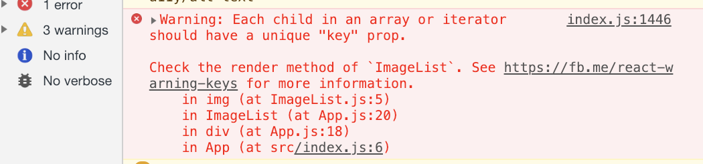
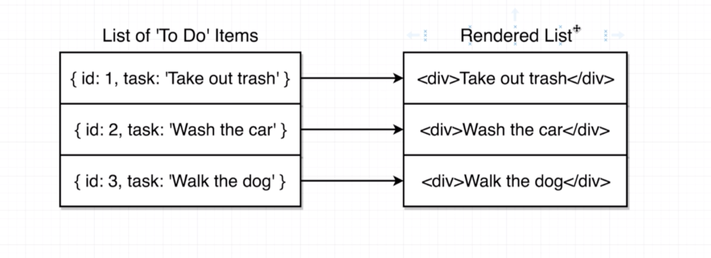
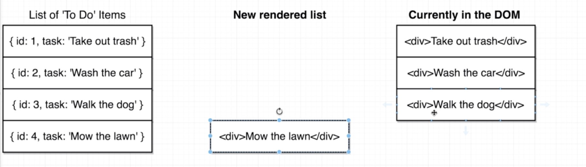

# Section09. Building Lists of Records

## Rendering Lists

* `ImageList.js` 컴포넌트 파일을 새로 생성해줌

```react
import React from 'react';

const ImageList = (props) => {
    console.log(props.images)
    return <div>ImageList</div>;
};

export default ImageList;
```

```react
///app.js
...
import ImageList from './ImageList';
...
<div className="ui container" styles{{marginTop: s'10px'}}>
    <SearchBar onSubmit={this.onSearchSubmit}/>
    <ImageList images={this.state.images}/>
</div>
```

## Review of Map Statements

* [테스트용](https://stephengrider.github.io/playgrounds/) 에 접속하여 다음과 같은 코드를 작성하며 `map`에 대해 복습함
* 아래와 같은 새로운 array를 만드는 코드를 작성해봄

```javascript
const numbers = [0,1,2,3,4];
let newNumbers = [];
for (let i = 0; i < numbers.length; i++){
    newNumbers.push(numbers[i] * 10);
}

numbers;
newNumbers;
```

* `map` 은 위의 코드와 같은 일을 함

```javascript
const numbers = [0,1,2,3,4];
numbers.map((num) => {
	return num * 10;
})
numbers.map(num => num * 10)//더 간략화
numbers; // [0,1,2,3,4]
```

## Rendering Lists of Components

* 이제 앞에 복습한 `map` 을 활용하여 이미지 리스트를 만들 수 있음

```react
import React from 'react';

const ImageList = props => {
    const images = props.images.map((image) => {
        return 
    });
    return <div>{images}</div>
};

export default ImageList;
```

* 이렇게 코드를 작성하면 에러가 발생함



## The Purpose of Keys in Lists

* 아래와 같은 앱이 있다고 가정



* 만약 새로운 아이템을 추가하려 할 때 아래와 같이 됨 


* 리액트는 아래와 같이 변하지 않은 것에 대해 re-render하려하지 않음




* 따라서 리액트는 key를 통해 빠르게 비교하여 re-render함


* 이는 모든 element에 관한 것이 아닌 list의 형태를 가진 element에만 해당

## Implementing Keys in Lists

* `img` 태그에 `id` 인자를 넘겨줌, 에러 해결

```react
//ImageList.js
...
return 
...
```

* 나머지 경고를 해결해주고 좀 더 코드를 간결하게 해주기 위해서는 아래와 같이 해결함
  * 경고의 경우 이미지를 대신할(alt) 속성이 없기 때문에 뜨는 경고

```react
import React from 'react';

const ImageList = props => {
    const images = props.images.map(({ description, id, urls}) => {
        return 
    });
    return <div>{images}</div>
};

export default ImageList;
```