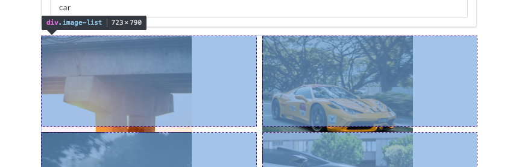
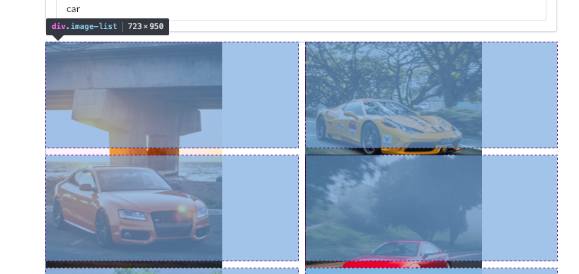
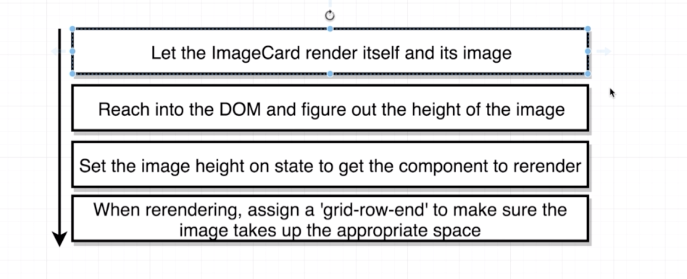
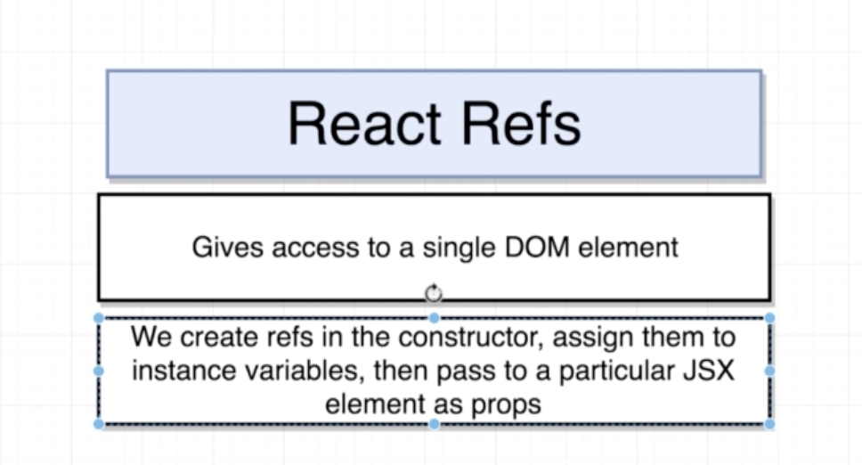
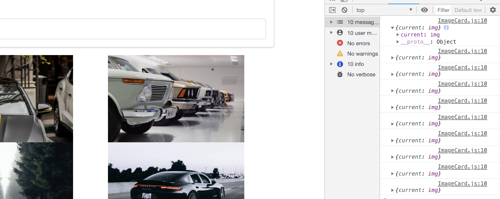
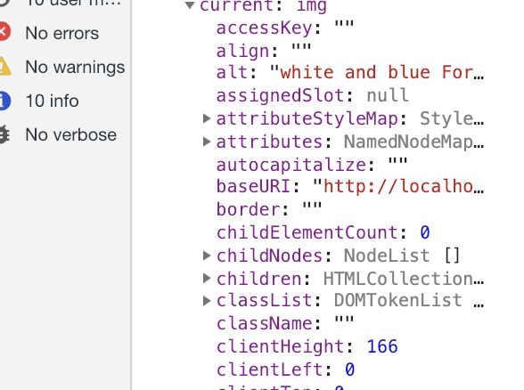
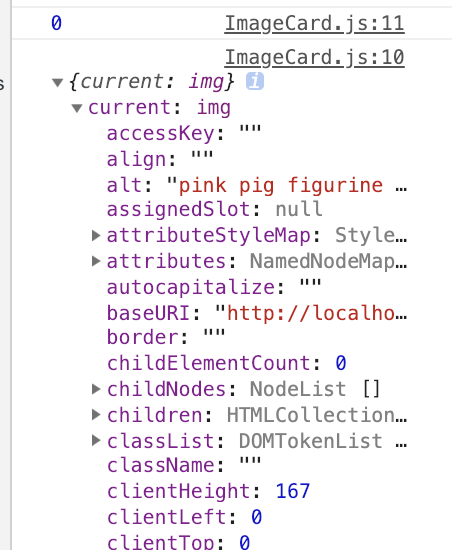

# Section10. Using Ref's for DOM Access

## Grid CSS

* `ImageList.css` 를 생성하고 `import` 해줌

```react
...
return <div className="image-list">{images}</div>
...
```

```css
.image-list{
    display: grid;
    grid-template-columns: repeat(auto-fill, minmax(250px, 1fr));
    grid-gap: 10px;
}

.image-list img{
    width: 250px;
}
```


## Issues with Grid CSS

* 우리가 원하는 이미지들에 맞춰 이미지가 정렬되지 않는 현상이 생김 이를 해결하기 위해 추가적인 css코드를 작성

```css
.image-list{
...
    grid-auto-rows: 150px;
...
```



* 추가로 `img`에  `grid-row-end: span 2;` 를 추가해주면 긴 이미지의 경우 두 칸을 차지함을 확인할 수 있음



* 이제 이렇게 긴 이미지의 경우 grid칸을 더 차지하게끔 이를 자동 계산하는 react코드를 작성하여 각 이미지 길이에 맞게 그리드 칸을 조정할 예정

## Creating an Image Card Component

* `ImageCard.js` 를 생성해줌

```react
import React from 'react';

class ImageCard extends React.Component{
    render(){
        return (
            <div>
                
            </div>
        );
    }
}

export default ImageCard;
```

* 코드의 편의를 위해 descructure out해줌

```react
//ImageCard.js
...
render(){
    const { description, urls } = this.props.image;
    return(
    	<div>
        	
        </div>
...
```

* 그리고 추가로 ImageList에 있던 코드를 다음과 같이 수정해줌

```react
import './ImageList.css';
import React from 'react';
import ImageCard from './ImageCard';

const ImageList = props => {
    const images = props.images.map((image) => {
        return <ImageCard key={image.id} image={image}/>
    });
    return <div className="image-list">{images}</div>
};

export default ImageList;
```

## Accessing the DOM with Refs

* 다음과 같은 과정으로 작동하게 하고싶음



* 보통은 사진의 높이를 얻고자 할때 바닐라JS 의 경우 아래와 같은 코드를 활용함
  * DOM에 접근할 때 `querySelector` 를 이용

```javascript
document.querySelector('img').clientHeight
```

* 하지만 react의 경우 **Refs**(Reference) 를 이용하여 DOM에 접근할 예정



## Accessing Image Height

* Refs를 만드는건 간단함 아래와 같이 `ImageCard.js` 에 코드를 추가해줌

```react
...
class ImageCard extends React.Component{
    constructor(props){
        super(props);
        this.imageRef = React.createRef();
    }
    componentDidMount(){
        console.log(this.imageRef);
    }
...
<div>
	
</div>
...
```

* 그러면 다음과 같이 콘솔에 찍히는 것을 확인할 수 있음, 또한 앞의 바닐라JS에서와 같이 `clientHeight` 를 얻을 수 있음 





* `console.log(this.imageRef.current.clientHeight);` 를 통해 각 높이들을 얻음
* 하지만 예상과는 달리 0만 잔뜩 찍히게 됨, render될때는 아직 사진이 로드되지 않았기 때문에 높이가 0으로 나옴

* 콘솔창에는 clientHeight가 나오는 이유는, 우리가 데이터를 펼쳐볼때는 이미 이미지 로드가 끝났기 때문임



## Callbacks on Image Load

* 앞의 이미지가 로드되기 전에 값을 불러오려는 문제를 해결하기 위해 JS의 Event Handler를 이용함
  * `setSpans`에서 예상되는 에러를 미리 처리하기 위해 arrow function을 사용

```react
componentDidMount(){
    this.imageRef.current.addEventListener('load', this.setSpans);
}

setSpans = () => {
    console.log(this.imageRef.current.clientHeight);
}
```

## Dynamic Spans

* span을 위한 코드를 추가하면 다음과 같음

```react
import React from 'react';

class ImageCard extends React.Component{
    constructor(props){
        super(props);
        this.state =  {spans: 0};
        this.imageRef = React.createRef();
    }

    componentDidMount(){
        this.imageRef.current.addEventListener('load', this.setSpans);
    }
    
    setSpans = () => {
        const height = this.imageRef.current.clientHeight;
        const spans = Math.ceil(height/150);
        this.setState({ spans });
    }

    render(){
        const { description, urls } = this.props.image;
        return(
            <div style={{gridRowEnd: `span ${this.state.spans}`}}>
                
            </div>
        );
    }
}

export default ImageCard;
```

* 다음과 같은 결과를 얻을 수 있음, 여기에 몇 가지 트릭을 더하면 완성


* 아래와 같이 수정하면됨

```react
...
const spans = Math.ceil(height/10);
...
```

```css
...
grid-gap: 0 10px;
grid-auto-rows: 10px;
...
```

