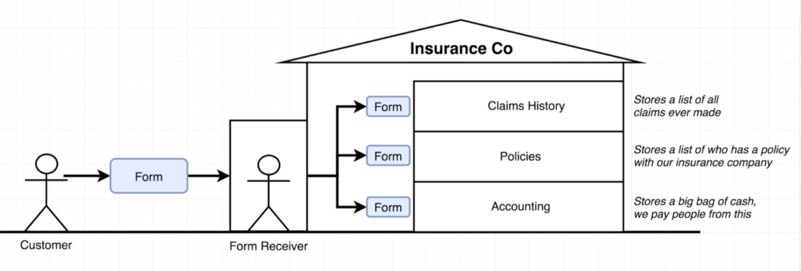
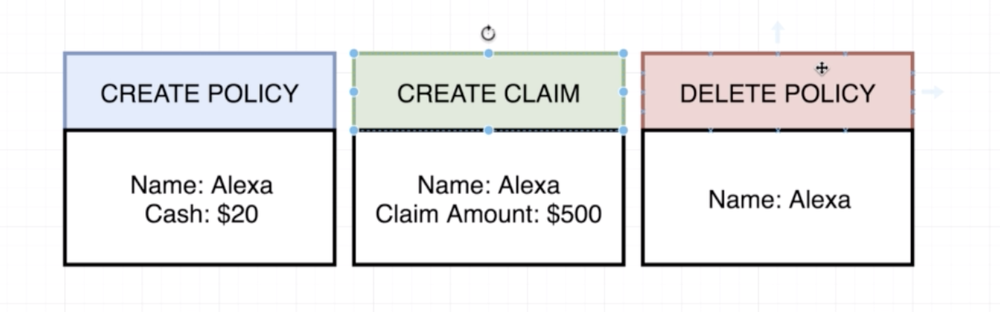

# Section12. On We Go...To Redux!

## Introduction to Redux

* Redux는 state를 관리하는 라이브러리임
* 리액트의 주 목적은 컨텐츠를 화면에 render하거나 사용자와 interaction하는 것임
* 따라서, 데이터를 업데이트하거나 유지하는 등의 데이터를 다루는 일은 모두 Redux에서 처리하게 됨
  * 리덕스는 리액트에서만 쓰는 것이 아니라 vue 등 js라이브러리로 쓰임


* 리덕스 러닝커브는 다음과 같음, 뒤로 갈수록 쉬워짐


## Redux by Analogy

* 학습순서


* 리덕스의 사이클


* 보험회사를 설립한다는 예시로 리덕스를 이해하면 쉬움


* 아래와 같은 순서로 회사가 작동
  * 손님이 policy라는 계약서를 갖고옴
  * 손님이 바로 회사의 부서로 계약서를 전달할 수 없음
  * Form Receiver에게 전달하면, 이를 복사하여 각 부서로 전달
  * 각 부서에 맞는 일을 처리



## A Bit More Analogy

* 세부적으로 들어가서 Policeies 부서가 하는 일을 보면 아래와 같이 Policies를 갖는 고객들의 리스트를 갖고 있음


* Management 부서가 매번 policy 리스트를 달라고 문을 두드리기 귀찮음


* 따라서 모든 데이터를 중앙 데이터에 저장을 함


## Finishing the Analogy

* Form이 다음과 같은 형태를 띈다고 가정


* 또한 form은 다음과 같은 타입을 가짐



## Mapping the Analogy to Redux

* 위의 보험회사를 리덕스로 놓고 보면 아래와 같음


## Modeling with Redux

* 편의를 위해 [CodePen](https://codepen.io)으로 실습을 진행
* Create하여 새로운 프로젝트를 생성
* Settings에서 Javascript 탭으로 이동하여 Redux를 검색하여 추가해주고 저장


* 주로 콘솔을 사용하여 실습

* Action Creator을 통해 세 가지 Action을 만들 예정


* Action은 `type`과 `payload`의 두 프로퍼티를 갖음
  * `type`의 경우 대문자 사용을 권장하며, 띄워쓰기 대신 `_` 를 권장함
  * `payload`는 정보를 담고 있음

```react
const createPolicy = () => {
  return {
    type: 'CREATE_POLICY',
    payload: {
      name: 'Alex',
      amount: 20
    }
  };
};
```

* 위의 하드코딩으로 `payload` 값을 넣기보다는 아래와 같이 수정하여 줌

```react
const createPolicy = (name, amount) => {
  return {
    type: 'CREATE_POLICY',
    payload: {
      name: name,
      amount: amount
    }
  };
};
```

* 혹은 아래와 같이 쓰일 수도 있음

```react
const createPolicy = (name, amount) => {
  return {
    type: 'CREATE_POLICY',
    payload: {
      name,amount
    }
  };
};
```

* `deletePolicy` 와 `createClain` action을 만들어줌

```react
const deletePolicy = (name) => {
  return {
    type: 'DELETE_POLICY',
    payload: {
      name: name
    }
  };
};
```

```react
const createClaim = (name, amountOfMoneyToCollect) => {
  return {
    type: 'CRETE_CLAIM',
    payload: {
      name: name,
      amountOfMoneyToCollect: amountOfMoneyToCollect
    }
  };
};
```

## Creating Reducers

* `claimHistory` 라는 reducer를 생성해줌

  * 인자로 이전 claim 리스트와 action을 받아옴
  * `[...oldListOfClaims, action.payload]` 는 ES6문법으로 다음과 같은 예시로 쉽게 이해할 수 있음
    * `push` 는 기존의 array에 값을 추가한다면 `...` 는 새 array를 생성해줌

  ```javascript
  const numbers = [1,2,3]
  [...numbers, 4] // [1,2,3,4]로 새 array를 생성
  ```


```react
const claimHistory = (oldListOfClaims, action) => {
  if (action.type === 'CREATE_CLAIM'){
    return [...oldListOfClaims, action.payload];
  }
  return oldListOfClaims;
};
```

* 추가로 인자를 넘겨줄 때, 초기 데이터가 없을 수도 있기 때문에 빈 행렬을 초기값으로 두어야함

```react
const claimHistory = (oldListOfClaims = [], action) => {
...
```

* `accounting` Reducer도 생성해줌

```react
const accounting = (bagOfMoney = 100, action) => {
  if (action.type === 'CREATE_CLAIM'){
    return bagOfMoney - action.payload.amountOfMoneyToCollect;
  } else if (action.type === 'CREATE_POLICY'){
    return bagOfMoney + action.payload.amout;
  }
  return bagOfMoney;
};
```


## Rules of Reducers

* `policies` Reducer를 생성해줌

  * JS의 `filter` 함수를 사용함, 아래의 예시 참고
    - `filter` 의 경우에도 새로운 array를 반환함(기존 array는 그대로)

  ```javascript
    const numbers = [1,2,3]
    numbers.filter(numb => numb !== 2) //[1,3]
  ```


```react
const policies = (listOfPolicies = [], action) => {
  if (action.type === 'CREATE_POLICY'){
    return [...listOfPolicies, action.payload.name];
  } else if (action.type === 'DELETE_POLICY') {
    return listOfPolicies.filter(name => name !== action.payload.name);
  }
  return listOfPolicies;
};
```

## Testing Our Example

* 지금까지 작성한 앱의 테스트를 위해 다음과 같이 호출하여 테스트

```react
const { createStore, combineReducers } = Redux;
const ourDepartments = combineReducers({
  accounting: accounting,
  claimHistory: claimHistory,
  policies: policies
});

const store = createStore(ourDepartments);

console.log(store.getState());
```

* `createPolicy` 를 `dispatch`하면 다음과 같은 결과를 확인할 수 있음

```react
store.dispatch(createPolicy('Alex', 20));
store.dispatch(createPolicy('Jim', 30));
store.dispatch(createPolicy('Bob', 40));
```


* `createClaim` 와 `deletePolicy` 를 `dispatch`

```react
store.dispatch(createClaim('Alex', 120));
store.dispatch(createClaim('Jim', 50));

store.dispatch(deletePolicy('Bob'));
```


## Important Redux Notes

* 리덕스의 싸이클을 다시 보면 다음과 같음


* key는 굳이 reducer의 이름과 같을 필요 없지만 비슷하거나 같기를 추천함


*  `store` 에 직접 접근하여 `state`를 조작하는 것은 불가능, 오로지 `dispatch`를 통해서만 가능
  * `store.state.accounting-100;` 와 같은 것 불가능

* 앱사이즈가 커질수록 복잡도의 증가는 다음과 같기 때문에 리덕스를 써야함


