# Section13. Integrating React with Redux

## React, Redux, and...React-Redux!?

* Redux 실습을 위해 다음과 같은 앱을 제작하여 실습할 예정

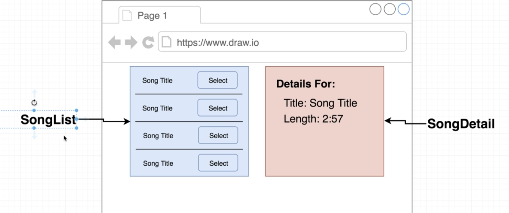

* 리액트와 리덕스를 함께 쓰기위해 Reaxt-Redux라는 라이브러리를 함께 설치하여 사용할 예정
  * React-Redux는 리액트와 리덕스 사이의 징검다리 역할을 함

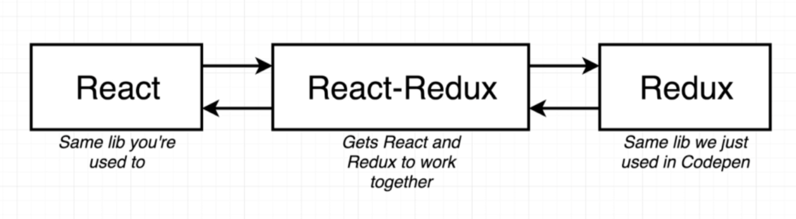

```bash
npm install --save redux react-redux
```

* sematinc-ui와 기본 세팅을 다 해줌

```react
//index.js
import React from 'react';
import ReactDOM from 'react-dom';
import App from './components/App';

ReactDOM.render(<App />, document.querySelector('#root'));
```

* 여기서 functional component를 사용한 이유는, redux를 이용하여 state를 관리하는 것이 주를 이루기 때문

```react
//App.js
import React from 'react';

const App = () => {
    return (
        <div>App</div>
    );
};

export default App;
```

## Design of the Redux App

* Redux가 없는 경우 다음과 같이 구조를 이룸

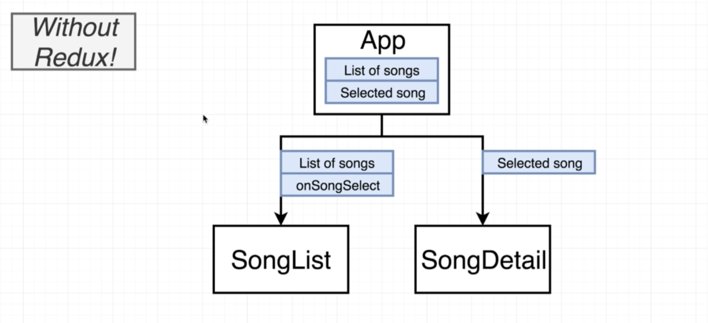

* Redux를 사용하는 경우 다음과 같음

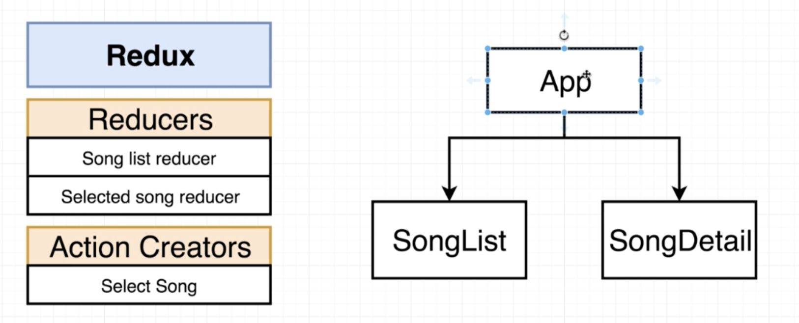

## How React-Redux Works

* React-Redux를 사용하기 위해 새로운 컴포넌트를 추가해줌
  * Store은 Reducers에 관한 모든 것을 담고 있으며 이를 Provider의 props로 넘겨줌
  * Provider은 앱의 최상단(최초)에 render됨
  *  최상단 Provider과 communicate함(context시스템을 이용하여)

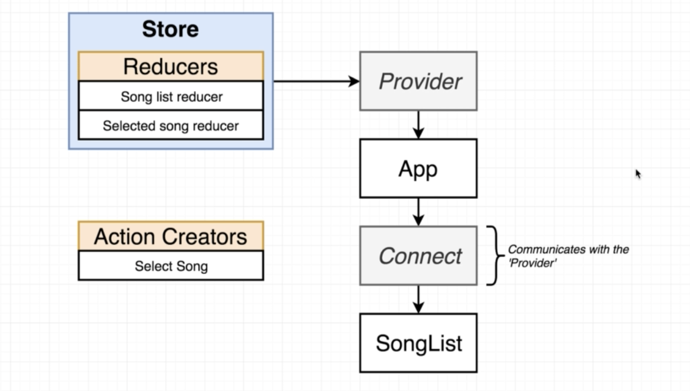

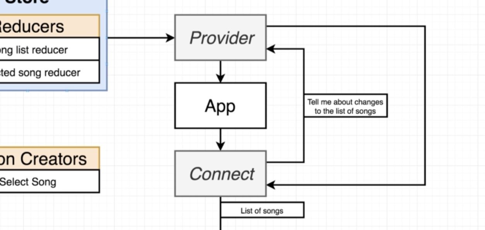

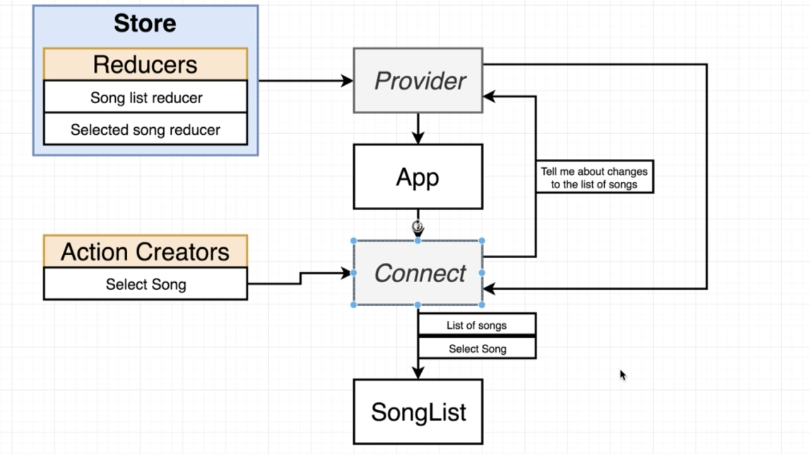

## Redux Project Structure

* 파일구조는 다음과 같이 구성할 예정

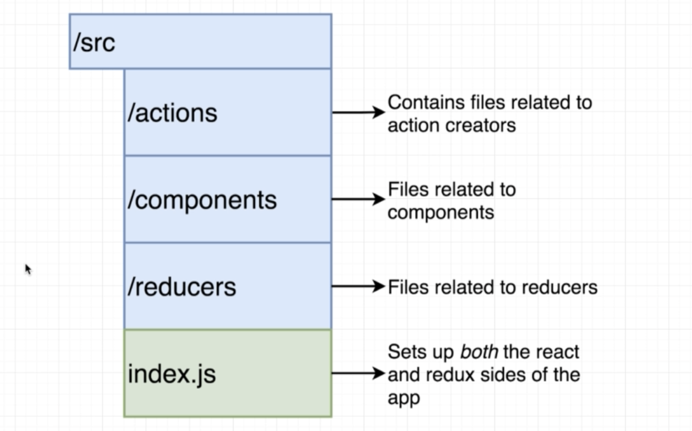

* 여기서 `/actions` 폴더에 `index.js`를 생성해주는데 이를 `App.js`에 `import` 할 때 굳이 `../actions/index.js`라고 할 필요 없이 `../actions` 만 해줘도 충분함
  * 웹팩을 이용하기 때문에, 폴더 이름만 import해주고 따로 파일을 명시하지 않으면 자동으로 그 안에 `index.js` 파일을 찾아 `import` 해줌

## Named vs Default Exports

* 보통의 경우 우리는 `export default` 를 사용하였지만, action creator에서는 `named export`를 사용함
  * 이는 `index.js` 안에서 다중으로 `export`할 예정이기 때문

```react
//../actions/index.js
export const selectSong = (song) =>{
    return {
        type: 'SONG_SELECTED',
        payload: song
    };
};
```

* `App.js` 내부에 `{}` 를 이용한 `import` 를 해주는데 이는 named export를 한 컴포넌트를 불러올 때 쓰임
  * `export default` 의 경우 `{}` 를 쓰지 않음

```react
//App.js
import React from 'react';
import { selectSong } from '../actions';
```

## Building Reducers

* Reducers에는 두 종류의 reducer이 있음
* `reducer` 디렉토리에 `index.js` 를 생성해줌

```react
const songsReducer = () => {
    return [
        {title: 'No Scrubs', duration: '4:05'},
        {title: 'Macarena', duration: '2:30'},
        {title: 'All Star', duration: '3:15'}
    ];
};
const selectedSongReducer = (selectedSong=null, action) => {
    if (action.type === 'SONG_SELECTED') {
        return action.payload;
    }
    return selectedSong;
}
```

## Wiring Up the Provider

* `../reducers/index.js` 에 리덕스의 `combineReducers` 를 `import` 해주는데 이때 `{}` 를 써줘야함
  * `combineReducers` 는 named export라서 그럼
  * 이런 외부 라이브러리를 쓰는 경우 꼭 도큐멘트를 참고하여 named인지 default인지 알고 사용해야 함
* 이전의 reducer부분에 위아래로 다음과 같은 코드를 추가해줌
  * combineReducers를 export default해줘서 앱의 어디서든 접근 가능하게함

```react
import { combineReducers } from 'redux';
...
export default combineReducers({
    songs: songsReducer,
    selectedSong: selectedSongReducer
});
```

* `index.js` 에 필요한 라이브러리들과 생성해준 reducers를 import 해줌

```react
import React from 'react';
import ReactDOM from 'react-dom';
import { Provider } from 'react-redux';
import { createStore } from 'redux';
import App from './components/App';
import reducers from './reducers';
...
```

* `<App/>` 을 `<Provider>` 로 감싸주고 인자를 넘겨줌
  * Store를 생성하여 생성한 reducers를 모두 담아 provider로 넘겨줌

```react
...
ReactDOM.render(
    <Provider store={createStore(reducers)}>
        <App />
    </Provider>,
    document.querySelector('#root')
);
```

## The Connect Function

* components에 `SongList.js` 생성

```react
//SongList.js
import React, { Component } from 'react';

class SongList extends Component {
    render() {
        return <div>Song List</div>;
    }
}

export default SongList;
```

```react
//App.js
import React from 'react';
import SongList from './SongList';

const App = () => {
    return (
        <div>
            <SongList />
        </div>
    );
};

export default App;
```

* React 라이브러리에서 component를 import하는 방식도 Named를 이용하여 사용가능

```react
import React, { Component } from 'react';

class SongList extends Component {
...
```

* connect를 사용하는 방법은 조금 특이함

  * 아래와 같은 코드를 통해 `connect()(SongList)` 의 작동방식을 이해하면 쉬움

  ```javascript
  function connect(){
      return function(){
          return 'Hi there!';
      }
  }
  connect()()
  ```

```react
import React, { Component } from 'react';
import { connect } from 'react-redux';
...
export default connect()(SongList);
```

## Configuring Connect with MapStateToProps

* `mapStateToProps`라는 함수를 정의하여 사용
  * 다른 이름으로 해도 상관 무

```react
//SongList.js
const mapStateToProps = (state) => {
    console.log(state);
    return state;
};

export default connect(mapStateToProps)(SongList);
```

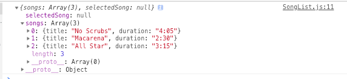

* 다음과 같이 render부에 콘솔창에 `this.props` 를 찍어보면 다음과 같이 `dispatch` 가 추가된 것을 확인할 수 있음

```react
import React, { Component } from 'react';
import { connect } from 'react-redux';

class SongList extends Component {
    render() {
        console.log(this.props);
        return <div>Song List</div>;
    }
}

const mapStateToProps = (state) => {
    return { songs: state.songs };
};

export default connect(mapStateToProps)(SongList);
```

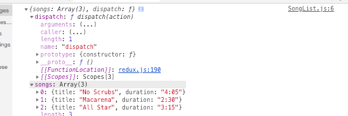

## Building a List with Redux Data

* 노래 리스트를 만들어 주기 위해 `renderList` 를 만들어줌
  * 내부 `return` 키워드는 `JSX` 를 반환
  * 외부 `return` 는 map하여 다시 array를 만들어 반환

```react
//SongList.js
...
class SongList extends Component {
    renderList() {
        return this.props.songs.map((song) => {
            return(
                <div className="item" key={song.title}>
                    <div className="right floated content">
                        <button className="ui button primary">
                            Select
                        </button>
                    </div>
                    <div className="content">{song.title}</div>
                </div>
            );
        });
    }

    render() {
        return <div className="ui divided list">{this.renderList()}</div>;
    }
}
...
```

```react
//App.js
...
const App = () => {
    return (
        <div className="ui container grid">
            <div className="ui row">
                <div className="column eight wide">
                    <SongList />
                </div>
            </div>
        </div>
    );
};
...
```

## Calling Action Creators from Components

* `connect`함수는 store된 데이터를 불러올 뿐만 아니라 action creators를 songlist로 불러오는 역할도 함
* `SongList.js`에 다음과 같이 추가해줌

```react
...
import {selectSong} from '../actions';
...
export default connect(
    mapStateToProps, 
    { selectSong }
)(SongList);
```

* 다음과 같이 onClick을 통해 선택된 버튼의 노래를 업데이트함

  * select버튼을 누를때 마다 `mapStateToProps` 함수는 재 실행됨

  * 이를 확인하기 위해 `mapStateToProps` 함수 내부에 state를 콘솔로 찍어봄

```react
...
renderList() {
    return this.props.songs.map((song) => {
        return(
            <div className="item" key={song.title}>
                <div className="right floated content">
                    <button 
                        className="ui button primary"
                        onClick={() => this.props.selectSong(song)}
                        >
                        Select
                    </button>
...
const mapStateToProps = (state) => {
    console.log(state);
    return { songs: state.songs };
};
...
```

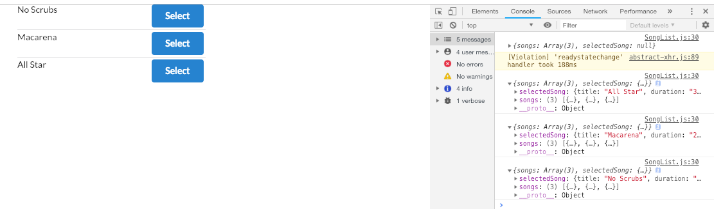

## Redux is Not Magic!

* 리덕스는 만능이 아님

  * 리덕스는 자동으로 action creator을 감지하지 않음
    * 반드시 connect함수를 통해 이를 감지하게끔 해야함
    * 절대 리덕스에 닿을 수 없으며 어떠한 일도 일어나지 않음

  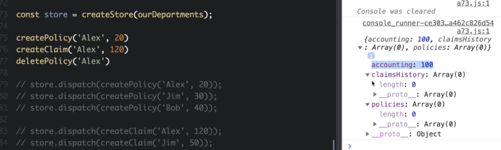

  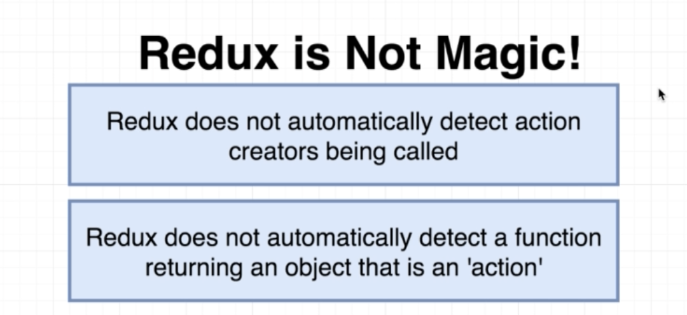

## Functional Components with Connect

* `SongDetail.js` 컴포넌트를 생성해줌

```react
import React from 'react';
import { connect } from 'react-redux';

const SongDetail = (props) => {
    console.log(props);
    return <div>Song Detail</div>;
};

const mapStateToProps = (state) => {
    return { song: state.selectedSong }
};

export default connect(mapStateToProps)(SongDetail);
```

```react
//App.js
import React from 'react';
import SongList from './SongList';
import SongDetail from './SongDetail';

const App = () => {
    return (
        <div className="ui container grid">
            <div className="ui row">
                <div className="column eight wide">
                    <SongList />
                </div>
                <div className="column eight wide">
                    <SongDetail />
                </div>
            </div>
        </div>
    );
};

export default App;
```

* 콘솔을 보면 처음에는 `song`이 `null` 이었다가 버튼을 클릭시 업데이트 되는 것을 확인할 수 있음

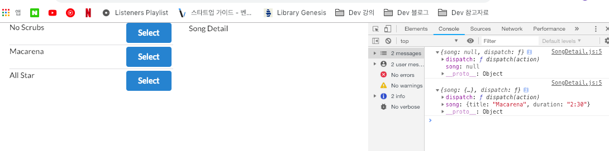

## Conditional Rendering

* 아래와 같이 간편하게 출력하는 코드로 바꾸면 에러가 발생함
  * 이 에러는 초기값이 null이기 때문에 발생 조건 render 코드를 추가해주면 됨

```react
//SongDetail.js
...
const SongDetail = ({ song }) => {
    return(
        <div>{song.title}</div>
    );
};
...
```

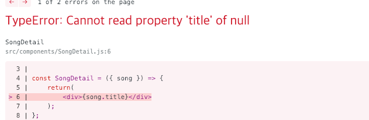

* 다음과 같이 코드를 추가하면 에러가 사라짐, 추가로 꾸며줌

```react
...
const SongDetail = ({ song }) => {
    if (!song) {
        return <div>Select a song</div>
    }
    return(
        <div>
            <h3>Details for:</h3>
            <p>
                Title: {song.title}
                <br/>
                Duration: {song.duration}
            </p>
        </div>
    );
};
...
```

